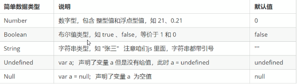
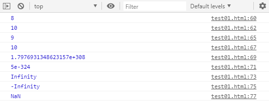
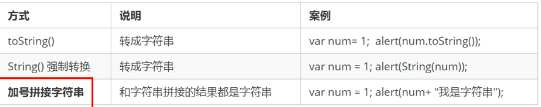
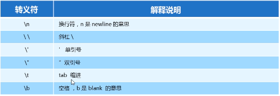
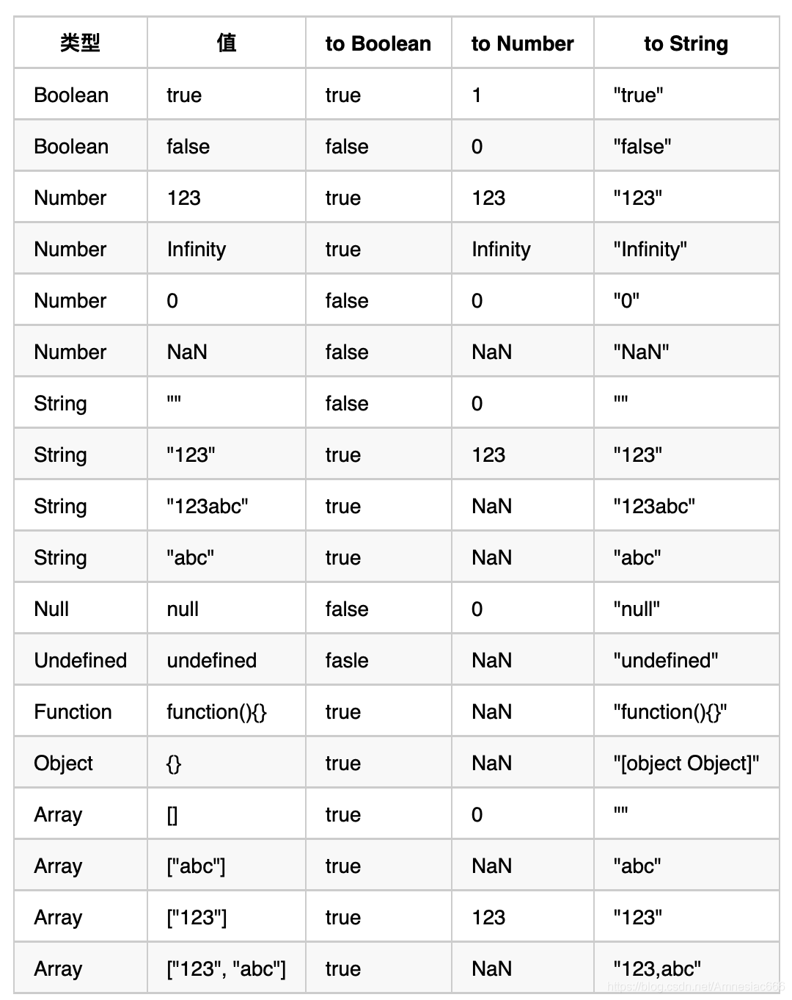
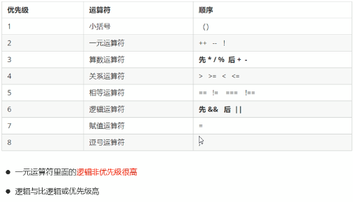

# **0.基础知识**

## **0.1 计算机基础**

## **0.2 计算机组成**

1. 硬件:

2. 1. 输入设备:鼠标, 键盘, 摄像头等
   2. 输出设备:显示器, 打印机, 投影仪等
   3. CPU:负责处理数据与运算
   4. 硬盘:和内容一起负责存储数据, 硬盘永久存储数据
   5. 内存:内存暂时存储数据

3. 软件:

4. 1. 系统软件:

   2. 1. 操作系统软件
      2. 语言处理软件
      3. 数据库管理软件
      4. 其他辅助程序软件

   3. 应用软件:浏览器, QQ, VSCode等

## **0.3数据存储单位**

- 1GB = 1024MB = 1024*1024KB ...
- 1B = 8bit

# **1.JS基础**

## 1.1 杂谈

- 布兰登-艾奇 (Brendan Eich)  创始人

- JavaScript是世界上最流行的语言之一, 是一种运行在客户端的脚本语言 (Script是脚本的意思)
- 脚本语言:不需要编译, 运行过程中由js解释器(js引擎)逐行进行解释并执行
- 现在也可以基于Node.js技术进行服务器端编程

+ **JS的作用**
  + 表单动态校验(密码强度检测) (JS最初产生的目的)
  + 网页特效
  + 服务端开发(Node.js)
  + 桌面程序(Electron)
  + APP(Cordova)
  + 控制硬件-物联网(Ruff)
  + 游戏开发(cocos2d-js)

- **HTML/CSS/JS的关系**

  1. HTML/CSS标记语言--描述类语言:

  2. 1. HTML巨鼎网页结构和内容(决定看到什么), 相当于人的身体
     2. CSS决定网页呈现给用户的模样(决定好不好看), 相等于给人穿衣服, 化妆

  3. JS脚本语言--编程类语言

  4. 1. 实现业务逻辑和页面控制(决定功能), 相当于人的各种动作

+ **浏览器执行JS简介**

  浏览器分为两部分:  渲染引擎和JS引擎

  - - **渲染引擎**: 用来解析HTML和CSS, 俗称内核, 比如Chrome浏览器的blink, 老版本的webkit
    - **JS引擎**: 也称JS解释器, 用来读取网页中JavaScript代码, 对其进行处理后运行, 比如Chrome浏览器的V8

  > ***浏览器本身并不会执行JS代码, 而是通过内置的JavaScript引擎(解释器)来执行JS代码, JS引擎执行戴马师逐行解释每一句原码(转换为机器语言), 然后由计算机去执行, 所以JavaScript语言归为脚本语言, 会逐行解释执行.***

+ **JS组成**

  + ECMAScript: ECMAScript规定了JS的编程语法和基础核心知识, 是所有浏览器厂商共同遵守的一套JS语法工业标准.

  https://www.runoob.com/w3cnote/es6-concise-tutorial.html (菜鸟教程)

  + DOM---文档对象模型

  **文档对象模型**(Document Object Model, 简称DOM), 是W3C组织推荐的可扩展标记语言的标准编程接口, **通过DOM提供的接口可以对页面上的各种元素进行操作**(大小, 位置, 颜色等)

  + BOM---浏览器对象模型

  **BOM**(Browser Object Model, 简称BOM)是指浏览器对象模型, 它提供了独立于内容的, 可以与浏览器窗口进行互动的对象结构, 通过BOM可以操作浏览器窗口, 比如**弹出窗, 控制浏览器跳转, 获取分辨率**等

## 1.2 变量

1. **变量的命名规范**

   - 严格区分大小写
   - 不能是关键字, 保留字
   - **驼峰命名法, 首字母小写**
   - **首字母特殊字符只能有$和_**
   - **不能以数字开头**
   - **name--此单词较为特殊, 尽量避免**

2. **typeof**

   > typeof str
   >
   > typeof(str)

## 1.3 数据类型

1. **JS中简单类型及其说明:**

   

### 1.3.1 Number

+ ***转为数字型***

  > **parseInt(变量)  强制转换**
  >
  > **parseFloat(变量)  强制转换**
  >
  > **Number(变量)  转换**
  >
  > **算数运算  -  *  /  (隐式转换)**

  

```js
        var num = 10;  //num 数字型
        var PI = 3.14;  //PI  数字型
        //1.八进制, 0~7, 程序中在数字前加0, 表示八进制
        var num1 = 010;
        console.log(num1);  //010, 八进制, 转化为十进制, 输出8
        var num2 = 012;
        console.log(num2);  //输出10
        //2.十六进制, 0~F, 程序中在数字前加0x, 表示十六进制
        var num3 = 0x9;
        console.log(num3);  //输出9
        var num4 = 0xa;
        console.log(num4);  //输出10
        //3.数字型的最大值
        console.log(Number.MAX_VALUE)  //MAX
        //4.数字型的最小值
        console.log(Number.MIN_VALUE);  //MIN
        //5.无穷大--(Infinity)
        console.log(Number.MAX_VALUE * 2)  //超过范围, 输出无穷大--Infinity
        //6.负无穷大--(-Infinity)
        console.log(-Number.MAX_VALUE * 2)  //(-Infinity)
        //7.非数字--NaN
        console.log('卡卡西' - 100);  //NaN--非数字
```



3. ***isNaN() -- 用来判断是否是数字***

### 1.3.2 String

+ ***转为String类型***

  

  ```js
          //1.变量.toString()转换为字符串类型
          var num = 10;
          console.log(num);
          console.log(num.toString());
          alert(num.toString());
          //2.String(变量)强制类型转换
          console.log(String(num));
          //3.拼接 (隐式转换)
          console.log(num + '');
  ```

+ 字符串中的转义字符(例, 在字符串里写**\n**可直接换行)

  

+ 字符串拼接 **+ 号口诀: 数值相加, 字符相连**

+ **str.length** 字符串长度(**包含空格**)

  ```js
          //1.检测获取字符串长度 length
          var str = 'my name is andy';
          console.log(str.length);  //15
          //2.字符串的拼接 + 
          //只要有字符串类型和其他类型拼接, 最后得到字符串类型
          console.log('沙漠' + '骆驼');  //'沙漠骆驼'
          console.log('卡卡西' + 16);  //'卡卡西18'
          console.log('卡卡西' + true);  //'卡卡西true'
          console.log(12 + 12);  //24
          console.log('12' + 12);  //'1212'
          var age = 18;
          console.log('卡卡西' + age);  //字符串 + 变量
  ```

### 1.3.3 boolean  undefined  null

+ 布尔型true的值为1, false值为0

+ undefined

+ null

  ```js
          var flag1 = true;  //flag1 布尔型
          var flag2 = false;  //flag2 布尔型
          console.log(flag1 + 1);  //true参与加法运算当1来看
          console.log(flag2 + 1);  //false参与加法运算当0来看
          //1.undefined--如果一个变量声明来赋值, 就是undedined, 未定义数据类型
          var str;
          console.log(str);
          var variable = undefined;
          console.log(variable + 'pink');  //字符串类型--unddfinedpin
          console.log(variable + 1);  //NaN, undefined和数字型相加, 最后的结果是NaN
          //2.null--空值
          var space = null;
          console.log(space + 'pink');  //nullpink
          console.log(space + 1);  //1
  ```

### 1.3.4 js隐式转换

+ [JS隐式类型转换规则](https://blog.csdn.net/Amnesiac666/article/details/116655073?utm_medium=distribute.pc_relevant.none-task-blog-2~default~baidujs_baidulandingword~default-4-116655073-blog-106920278.pc_relevant_blogantidownloadv1&spm=1001.2101.3001.4242.3&utm_relevant_index=7)

  

+ ***Java中隐式类型转换优先级:***

+ - ***byte→short(char)→int→long→float→double（这里指的是只有前面的数据类型能随便转换成后面的）***

## 1.4 运算符

### 1.4.1 运算符优先级



### 1.4.2 短路运算符

> **原理: **当有多个表达式(值)时, 左边表达式可以确定结果时, 就不再继续运算右边表达式值

```js
        //有空的或否定为假, 其余是真的
        console.log(null && 1);  //null
        console.log('' && 1);  //
        console.log(Boolean(null && 1));  //false
        console.log(Boolean('' && 1));  //false
        console.log(Boolean(' ' && 1));  //true
```

## 1.5 date

>+ **var now = new Date() 获取当前时刻其中Date()中可取**
>  + ‘2022-12-12 16:00’
>  + ‘2022 12 12 16:00’
>+ **获取年月日时分秒**
>  + xxx.getFullYear()  // getYear()获取从1970年至今
>  + xxx.getMonth()
>  + xxx.getDate()
>  + xxx.getHours()
>  + xxx.getMinutes()
>  + xxx.getSeconds()
>  + xxx.getMillisecond()  //返回毫秒
>+ **时间戳**
>  + Day = parseInt (时间戳 / 1000 / 60 / 60 / 24)
>  + Hour = parseInt (时间戳 / 1000 / 60 / 60 % 24)
>  + Minute = parseInt (时间戳 / 1000 / 60 % 60)
>  + Second = parseInt (时间戳 / 1000 % 60)

```js
		// 常用date方法
        let selTime = new Date('2022-12-12');
        console.log('当前时间： ', selTime);
        console.log('时间转换时间戳： ', new Date(selTime).getTime());
        console.log('时间戳转换为时间： ', new Date(parseInt(new Date(selTime).getTime())).toLocaleString())

		// 显示一个日期的中文格式
		function getThisDate(now) {
          var timeStr = now.getFullYear() + '年' + (now.getMonth() + 1) + '月' + now.getDate() + '日' + now.getHours() + ':' + now.getMinutes() + ':' + now.getSeconds();
          return timeStr;
        }
		// getThisDate()
		let theTime = new Date(2000, 8, 10, 12, 23, 36);
		console.log('theTime: ' + getThisDate(theTime));
```


# 2.Array

## 2.1 数组去重

1. **Set 去重 (ES6)**

```js
function unique(arr) {
  return Array.from(new Set(arr))
}
```

2. **splice 去重**

```js
// NaN, {} 不能去重, null 直接消失
function unique(arr) {
	for (var i = 0; i < arr.length; i++) {
		for (var j = i +1; j < arr.length; j++) {
			if (arr[i] == arr[j]) {
				arr.splice(j, 1);
				j--;
			}
		}
	}
}
```

3. **indexOf 去重**

```js
// NaN, {} 不能去重
function unique(arr) {
    if (!Array.isArray(arr)) {
        console.log('type error!');
        return;
    }
    var array = [];
    for (var i = 0; i < arr.length; i++) {
        // 下标为 -1 表示元素在数组中不存在
        if (array.indexOf(arr[i] === -1)) {
            array.push(arr[i]);
        }
    }
    return array;
}
```

4. **sort()**

```js
// NaN, {} 不能去重
function unique(arr) {
    if (!Array.isArray(arr)) {
        console.log('type error!');
        return;
    }
    arr = arr.sort();
    var array = [arr[0]];
    for (var i = 1; i < arr.length; i++) {
        if (arr[i] !== arr[i - 1]) {
            array.push(arr[i]);
        }
    }
    return array;
}
```

5. **includes**

```js
// {} 没有去重
/*
	//Array.inclues()方法, 数组中有该元素返回 true, 没有返回false
	let arr = [1, 2, 'dada', 4, NaN];
	arr.includes(NaN);  // true
	arr.includes(5);  // false
*/
function unique(arr) {
    if (!Array.isArray(arr)) {
        console.log('type error!');
        return;
    }
    var array = [];
    for (var i = 0; i < arr.length; i++) {
        if (!array.includes(arr[i])) {
            array.push(arr[i]);
        }
    }
    return array;
}
```

6. **hasOwnProperty**

```js
// hasOwnProperty(propertyName)方法 是用来检测属性是否为对象的自有属性，如果是，返回true，否者false
// 全部去重
function unique(arr) {
    var obj = {};
    return arr.filter(function(item, index, arr) {
       return obj.hasOWnProperty(typeof item + item) 
    });
}
```

7. **filter**

```js
function unique(arr) {
    return arr.filter(function(item, index, arr) {
        // 当前元素, 在原始数组中的第一个索引 == 当前索引值, 否者返回当前元素
        return arr.indexOf(item, 0) === index;
    })
}
```

8. **递归**

```js
// null, {} 不去重
function unique(arr) {
    var array = arr;
    var len = array.length;
    // 排序方便去重
    array.sort(function(a, b) {
        return a - b;
    })
    // 开始递归遍历
    function loop(index) {
        if (index >= 1) {
            if (array[index] === array[index - 1]) {
                array.splice(index, 1);
            }
            loop(index - 1);  // 递归, 去重
        }
    }
    loop(len - 1);
    return  array;
}
```

9. **Map**


# 3.Object

## 3.1 枚举类型

```js
// 枚举: 是指对象(数组也是对象)中的属性可以遍历出来, 简单的说就是属性可以列举出来
// 可枚举性决定了这个属性是否能被for...in查找遍历到
// js中基本包装类型的原型(prototype)不可枚举, 如Object, Array, Number等
var num = new Number();
for(var pro in num) {
    // 无任何输出, 因为num.length = 0
    console.log("num." + pro + " = " + num[pro]);
}

```

# 4.函数

# 5.this

# # 拓展

## #.1 'use strict' 严格模式

>**设立严格模式的目的：**
>
>+ 消除Js语法中的一些不合理, 不严谨之处, 减少了一些怪异行为
>+ 消除代码运行的一些不安全之处, 保证代码运行安全
>+ 提高编译器效率, 增加运行速度
>+ 为未来新版本的Js做好铺垫

## #.2 eval()

>+ **eval(string)**
>+ **eval() 函数计算 Js字符串， 并把它作为脚本代码来执行, 如果参数是一个表达式， eval()函数将执行表达式. 如果参数是Js语法， eval() 函数将执行Js语句**

```js
eval('x=10; y=20; document.write(x*y)');  // 200
document.write('<br>' + eval('2+2'));  // 4
document.write('<br>' + eval(x+17));  // 27
```

## #.3 window.$

```js
(function() {
  var $ = (window.$ = {});
  console.log($);
  $.web = 'thisTiTs';
  console.log($.web);
  var what = 'whatDoit';
  $.getWhat = function() {
    return what;
  }
  console.log($.getWhat);
  console.log(this);
}.bind(window)())
console.log(window)
```


