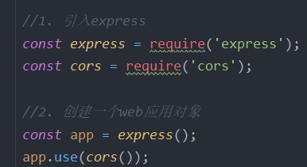

# 1 NodeJS简介

## 1.1 NodeJS特点

- **非阻塞式的异步I/O  (异步, 回调)**
- **单线程, 异步回调 (回调解决异步是否执行问题)**
- **事件驱动**
- **跨平台**

## 1.2 npm 包管理器(node package)

1. **管理项目中的插件**

2. **npm初始化package.json文件 (通过终端执行命令)**

   1. 切换到创建package.json的文件目录

      > npm init
      >
      > npm init -y  // 快速生成

3. **npm包管理步骤:**

   1. 保证项目跟目录中有package.json文件

   2. npm常用命令

      > **npm install 包名(插件名)**  -->  安装
      >
      > **npm install 包名@版本号**  -->  带版本安装
      >
      > **npm install**  -->  根据package.json记录还原所有插件
      >
      > **npm install 插件名 -D**  -->  安装开发环境时的插件 (devDependencies)
      >
      > **npm install 插件名 -S**  -->  安装生产时的插件(dependencies)
      >
      > **npm uninstall 包名**  -->  删除npm

4. **dependencies 和 devDependencies的区别**

   + **devDependencies 里面的插件只用于开发环境**，不用于生产环境，而 **dependencies 是需要发布到生产环境的**。

   + [^例如]: 比如我们写一个项目要依赖于jQuery，没有这个包的依赖运行就会报错，这时候就把这个依赖写入dependencies ；而我们使用的一些构建工具比如glup、webpack这些只是在开发中使用的包，上线以后就和他们没关系了，所以将它写入devDependencies。理解webpack打包原理

     ```json
     "dependencies": {
       "bootstrap": "^5.2.0",
       "jquery": "^3.6.1",
       "layui": "^2.7.6",
       "node": "^16.17.0",
       "node-bin-setup": "^1.1.0",
       "swiper": "^5.4.5"
     },
     ```

## 1.3 commonJS规范

### 1.3.1 module

> ​	**require()**  引入模块
>
> ​	**module exports**  作为一个文件的唯一出口对象

## 1.4 http模块

+ **http模块, 用于搭建服务器**
+ ***mode里, 当使用模块时, 需要先引入该模块, 引入模块的语法遵循: "commonJS"***

```js
//1.引入http模块
const http = require("http");
console.log(typeof http);
console.log(http);

//2.创建服务器, 并监听前端发起的请求
const server = http.createServer(function (req, res) {

    console.log("有人请求我");
    //设置相应头
    res.setHeader("Content-Type", "text/html; charset=utf-8");
    res.end("hello, client! 今天周一");
});

//3.开启服务器, 并设置端口
server.listen(7788, function () {
    console.log("服务器已开启, 监听7788端口");
});
```

## 1.5 fs模块

```js

```

# 2 express

## 2.1 引入express

+ **基于Node.js平台, 快速, 开放, 极简的Web开发框架, 用于快速搭建Web服务器, 对前端请求做出响应**
+ **注意: express不是node自带模块, 需要先安装, 后使用**

```js
// 1.引入js
const express = require('express');
// 解决跨域问题
const cors = require('cors');
// post 取值用
const bp = require('body-parser');
const fs = require('fs');
// 引入formidable插件, 解析表单数据 (和用表单接收数据方法基本相同)
// formidable传入数据类型要用formData
const formidable = require('formidable');

// 2. 创建一个web应用对象
const app = express();
app.use(cors());

/*
* express创建好一个app应用对象之后, 该对象有5个常用方法
*   1. app.get()        监听前端发起的get请求
*   2. app.post()       监听前端发起的post请求
*   3. app.all()        监听前端发起的所有网络请求
*   4. app.use()        为express应用其他插件(中间件)
*   5. app.listen()     开启express服务器并设置端口号
*
*   get(), post(), all() 方法中都接收两个参数
*   参数1: 路由, 可以写精确路由, 也可以写 * 表示通配路由
*   参数2: 回调函数, 该回调函数会在监听到匹配的网络请求时触发
* */

app.get('/ajaxGet', function (req, res) {

});
app.post('/ajaxPost', function (req, res) {

});
// 监听 '废物' 请求, 类似于 Switch 中的 default
app.all('*', function (req, res) {

});


// 3.开启服务器并设置端口
app.listen(61234, function () {
    console.log('服务器已开启, 监听61234端口');
});

```

+ ***cors插件用于跨域请求, 使用方式为:*** 

+ 

+ ***express创建的app对象的5个常用方法:***

  > + **app.get()** 监听前端发起的get请求
  > + **app.post()**  监听前端发起的post请求
  > + **app.all()**  监听前端发起的所有网络请求
  > + **app.use()**  为express应用其他插件 (***中间件***)
  > + **app.listen()**  开启express服务器, 并设置端口号

+ ***get(), post(), all() 方法都接收两个参数***
  + 参数1: 路由, 可以写精确路由, 也可以写 ***** 表示通配路由
  + 参数2: 回调函数, 该回调函数会在***监听匹配的网络请求时触发***
  + 

# 3 文件/文件夹 操作

## 3.1 **fs模块引入**

```js
//fs模块, node里对文件进行操作的模块
const fs = require("fs");
console.log(fs);

// __filename --> 当前文件的绝对路径
// __dirname --> 当前文件夹的绝对路径
```

## 3.2 文件操作

### 3.2.1 读(文件)

```js
fs.readFile("book.txt", "utf-8", function (error, data) {
    /*console.log(error);
    console.log(content);*/
    if(!error) {
        console.log("读取文件成功", data);
    }else {
        console.log("读取文件失败", error);
    }
});
```

### 3.2.3 写(文件)

```js
// 写入
// 向文件里写入数据, 如果发现文件不存在, 系统会先新建一个文件, 再向里写入, 如果文件存在, 直接打开并写入
// data 覆盖
// flag 控制文件写入方式
fs.writeFile('b.txt', '写入内容', {encoding: 'utf-8', flag: 'a'}, function(error) {
    if(!error) {
        console.log(error);
    }
});
```

### 3.2.3 删(文件)

```
fs.unlink('a.txt', function (error) {
    if(!error) {
        console.log('删除文件成功');
    }else {
        console.log(`删除文件失败, 失败原因: ${error}`);
    }
});
```

### 3.2.4 获取文件信息

```js
fs.stat('b.txt', function (error, info) {
    if(!error) {
        console.log(info);
    }else {
        console.log(`this文件信息获取失败, 失败原因: ${error}`);
    }
});
```

### 3.2.5 文件重命名

```js
// 注意: 如果重命名的文件路径与原路径不同, 执行的是文件移动效果
fs.rename('book.txt', '../node_01/a.txt', function (error) {
    if(!error) {
        console.log('文件重命名成功');
    }else {
        console.log(`文件重命名失败, 失败原因: ${error}`);
    }
});
```

## 3.3 文件夹操作

### 3.3.1 创建(文件夹)

```js
// 当前js文件所在 文件夹绝对路径下 创建文件夹
fs.mkdir(__dirname + '/bookFile', function (error) {
    console.log('成功创建');
});
```

### 3.3.2 读(文件夹)

```js
fs.readdir(__dirname + '/theFile', function (error, filesInfo) {
    if (!error) {
        console.log(filesInfo);
    } else {
        console.log(`读取文件夹失败, 失败原因:${error}`);
    }
});
```

### 3.3.3 删(文件夹)

```js
fs.rmdir(__dirname + '/bookFile', function (error) {
    if(!error){
        console.log('删除文件夹成功');
    }else {
        console.log(`删除文件夹失败, 失败原因: ${error}`);
    }
});
```

### 3.3.4 判断是否是文件

```js
// 先同步判断状态, 确保查询文件夹状态已全部完成执行
let fileState = fs.statSync(__dirname + '/文件夹路径');
// 判断是否为文件 是文件返回 true, 否则返回 false
flag = fileState.isFile();
```

### **3.3.5 ※ 封装函数, 删除任意路径下的文件夹**

```js
// ※
// 封装一个方法, 删除任意路径下的文件夹
function removeDir(dirPath) {
    //获取文件夹里的所有内容
    let filesInfo = fs.readdirSync(dirPath);
    //遍历文件夹内容数组,判断是文件还是文件夹,文件直接删除,文件夹再次调用本方法,继续获取子文件夹里的所有内容
    filesInfo.forEach(fName => {
        let fPath = dirPath + "/" + fName;
        let fStat = fs.statSync(fPath);
        console.log(fStat.isFile());
        if (fStat.isFile()) {
            //是文件直接删除
            fs.unlinkSync(fPath);
        } else {
            //是文件夹,重复调用本方法,进行下一次循环判断
            removeDir(fPath);
        }


    });
    //将已清空的文件夹删除
    fs.rmdirSync(dirPath);
}
// 执行
let dirPath = __dirname + "/theFile";
removeDir(dirPath);
```

# 4 数据库操作

## 4.1 数据持久化

1. ***localStorage***
2. ***cookie***
3. ***sessionStorage***
4. ***文件读写***
5. ***数据库***
   1. **mysql数据库: **关系型数据库, 通过sql语句 (*structure query language*) 语句对数据库的数据进行操作 **(在数据表中查询)**
   2. **mongodb数据库: **非关系型数据库, 其存储方式是通过文件进行存储, 对该数据库的操作语法接近JS的对象操作, 而不是sql语句

## 4.2 mongodb开启

1. **安装mongodb**

   1. 初始化:
      1. ***在指定位置创建空文件夹***
      2. ***通过终端进入mongodb安装目录的bin***
      3. ***使用命令: mongod --dbpath=指定文件夹路径***  *(等号中间不要有空格!)*

   2. 开启数据库:
      1. ***再新建终端(1.2开启的终端不退出(首次初始化)), 来到mongodb安装目录的bin文件夹下***
      2. ***启动数据库, 使用命令: mongo***

   3. 指定当前数据的存储位置
   4. 通过js操作mongodb, 需要借助插件: **mongoose**

## 4.3 数据库使用

+ **初始化服务器后, 将数据库链接放到服务器开启之后再执行, 同样, 也要在数据库链接成功的基础上再进行后面的逻辑**

+ **链接数据库: **

  + ```js
    mongoose.connect('mongodb://地址:数据库端口号/建数据库名(没有则新建)')
    // 监听数据库链接情况, 在数据库链接成功基础上再进行后面的逻辑
    mongoose.connection.on('open', function()) {
    	console.log('数据库链接成功!')
    }
    ```

+ **mongoose.Schema:**

  + 

  + ```js
    // 1.调用mongoose.Schema方法, 创建sheetSchema模型骨架
    // 类同: const sheetSchema = new mongoose.Schema
    const {Schema} = mongoose;
    const sheetSchema = new Schema({
        // 字段名: 类型, 默认值或其他属性(可选)
        field1: String,
        field2: {type: Number, min 1}, //最小值设为1
        field3: {type: String, default: '默认字符'}
        ...
    });
    // 2.用sheetSchema模型骨架, 创建模型--sheetModel
    const sheetModel = mongoose.model('数据表名(mongodb中)', sheetSchema);
    // 3.传数据, 进行增, 删, 改, 查...
    
    ```

+ ***数据库操作 (要在sheetModel创建的基础上)***

  + **生成数据**

    ```js
    // 生成数据到mongodb
    app.post('/生成数据路由', function (req, res) {
        // 解构
        let {field1, field2, field3...} = req.body;
        // 插入数据
        sheetModel.create({
            field1,
            field2,
            field3,
            ...
        }, function (error, result) {
            let data;
            if (!error) {
                console.log('插入数据成功', result);
                data = {status: 'ok', msg: result};
            } else {
                console.log('插入对象失败', error);
                data = {status: 'no', msg: error};
            }
            res.send(data);
        });
    });
    ```

  + **获取(查询)数据**

    ```js
    app.get('/getAllPros', function (req, res) {
        /*
    	* 查询数据, 语法:
    	* 模型对象, find(查询条件(可选), 想要获取的字段(可选), 筛选条件(可选), 回调函数)
    	* */
        
        // 写法1. 全部查询
        proModel.find(function (error, result) {
            if (!error) {
                console.log(result);
                res.send(result);
            } else {
                console.log(error);
            }
        });
    
        // 写法2. 通过查询条件获取数据
        proModel.find({
            proPrice: 33
        }, function (error, result) {
            if (!error) {
                console.log(result);
                res.send(result);
            } else {
                console.log(error);
            }
        });
    
        // 写法3. 查询范围
        /*
    		* 表示范围的key写法:
    		*   $gt: 大于
    		*   $lt: 小于
    		*   $gte: 大于等于
    		*   $lte: 大于等于
    		*   $ne: 不等于
    		*   $in: 包含
    		*   $nin: 不包含
    		*
    		* */
        proModel.find({
            proPrice: {
                $gt: 50,
                $lt: 200
            },
            proType: {
                $in: ['水果', '蔬菜']
            }
        }, function (error, result) {
            if (!error) {
                console.log(result);
                res.send(result);
            } else {
                console.log(error);
            }
        });
    
        /*
    	4. 查询数据时设置想要获取的字段
    		想要的字段设置为1, 没写的字段默认为0 (除了_id)
    		不想要的字段设置为0, 没写的默认为1 (_id必须亲自设置为0, 才不会获取)
    	*/
        proModel.find(null, {_id: 0}, function (error, result) {
            if (!error) {
                console.log(result);
                res.send(result);
            } else {
                console.log(error);
            }
        });
    
        /*
    		5. 通过筛选条件获取数据
    			5.1 sort 排序 (1: 升序, -1: 降序)
    			5.2 skip 跳过几条数据, 跳多为空
    			5.3 limit 限制条数
    	* */
        proModel.find(null, {_v: 0}, {sort: {proPrice: 1}, skip: 2, limit: 2}, function (error, result) {
            if (!error) {
                console.log(result);
                res.send(result);
            } else {
                console.log(error);
            }
        });
    });
    ```

  + **删除数据**

    ```js
    // 删除点击的数据
    app.post('/deletePro', function (req, res) {
        let {deleteId: _id} = req.body;
        /*
    	* 删除数据库数据
    	* 模型对象.deleteOne(查询条件, 回调函数)  如果查询到的数据有多个, 会删除第一个
    	* 模型对象.deleteMany(查询条件, 回调函数)
    	*
    	* */
    
        // 通过_id删除数据
        proModel.deleteOne({_id}, function (error, result) {
            let data;
            if (!error) {
                console.log(result);
                data = {status: 'ok'};
    
            } else {
                console.log(error);
                data = {status: 'error', error};
            }
            res.send(data);
        });
    });
    ```

    