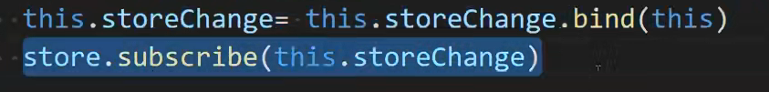
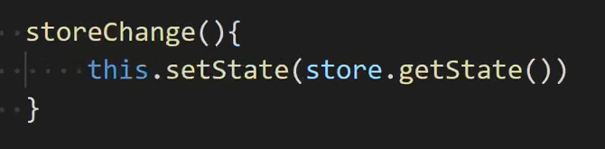
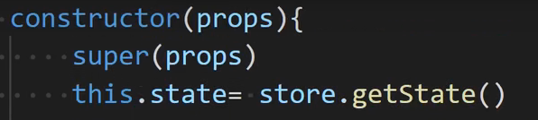
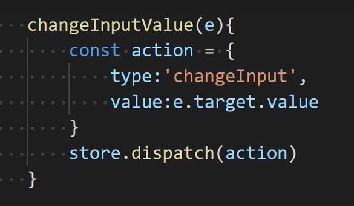
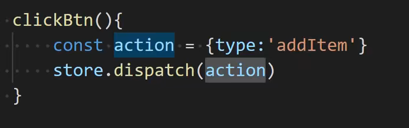
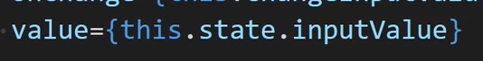
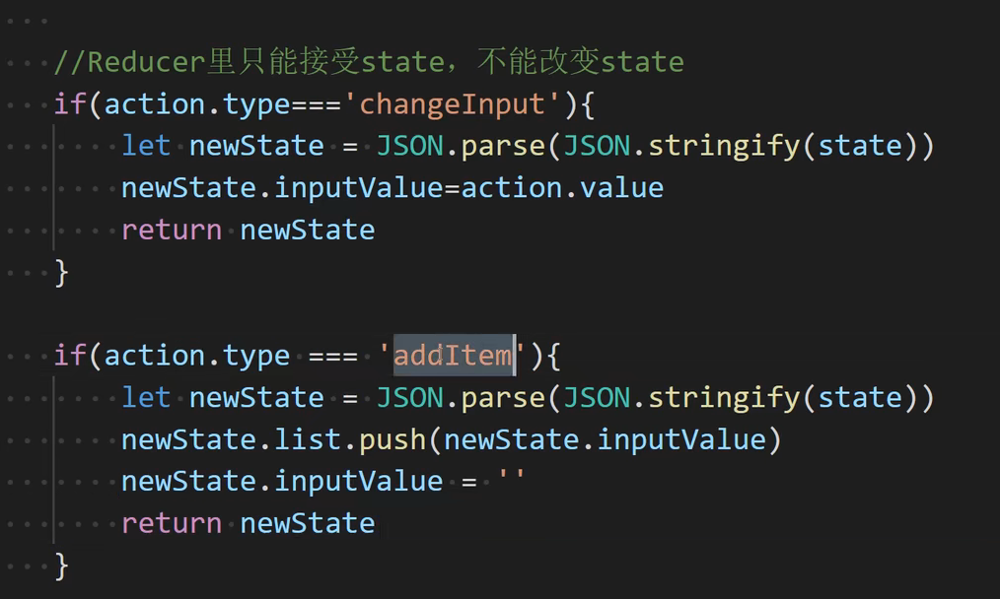

# 1. JSX语法

> **JSX语法:**
>
> ​	利用js的语法书写html标签, 而且生成的标签以让是虚拟dom
>
> ​	注意: JSX语法的本质其实是 React.createElement() 的语法糖
>
> **React里JSX语法书写时的注意事项:**
>
> 1. JSX语法结构可以整个包裹在小括号()里, 小括号可以不加
> 2. JSX语法里也可以声明注释, 但是需要 {} 包裹
> 3. JSX语法里可以通过 {} 进行声明式直接渲染变量, {} 为react的编译环境,在 {} 里可以直接填写变量, 表达式, 函数调用等
> 4. 如果JSX结构里有单标签, 单标签必须以 / 结尾
> 5. 一个JSX结构里有且必须只能有一个根标签, 有多个会报错
>
> **表达式, 由常量/变量/运算符 中 某些组成, 并有结果 (操作表达式, 实际是上是操作表达式的结果)**

# 2. **组件**

> **React允许我们将UI视图, 拆分成可以复用的代码片段, 并对每个片段单独构思我们将这些每个独立的UI片段称为 "组件"**

## 2.1 函数式组件

```react
/*
	函数式组件: 
		本质上是一个函数, 将组件自身UI结构对应的JSX结构当做函数的返回值return出来, 代码简单清晰, 但是因为其本身是函数, 无法	挂载组件的副作用方法, 所以一般都当做纯展示组件使用
*/

/*
	函数组件的执行过程:
		1.函数式组件在使用时可以直接调用函数, 也可以以标签的形式使用
        2.不管是以函数调用的方式还是标签的形式使用, React都会在全局去查找对应名字的函数,如果找到, 调用该函数
        3.函数调用的语法如果想要往组件内部传参, 直接传实参即可, 函数内通过形参接收
        4.标签调用的语法如果想要往组件内部传参, 需要将想要传入的值以自定义属性的语法写到标签上, react会将其自动转化成键值对给函数的第一个形参,我们一般命名为props对象
*/

// 函数组件Welcome
function Welcome(theName) {
    regurn <h1>hello, {theName}</h1>
}
ReactDOM.render(Welcome((<div>
        {
            [Welcome('React'),Welcome('Angular')]
        }
        {
            Welcome('Vue')
        }
    </div>)), app)

// 函数组件 App
// 参数命名为props是为了对应class (无特殊意义)
function App(props) {
    return <h1>hello, {props.a}{props.b}</h1>
}
ReactDOM.render(<div>
        <App a = '我敲'></App>
        <App a = '我也敲', b = '我再敲'></App>
    </div>)
```


## 2.2 class组件

```react
/*
	class组件:
		本质上是一个类(es6里的class), 每个组件都是该class实例化出的一个对象,该class里有一个render方法, 用于返回组件自身的UI结构, 因为语法为class, 所以这样的组件可以继续挂载一些副作用方法,如: 生命周期函数等, 但是语法晦涩, 逻辑较为复杂
*/

/*
	class组件的执行过程:
		1.当React执行到<Welcome1/>时, 会查找是否有同名的函数或者class
        2.找到对应名字的class之后, 会通过这个class, 实例化(new)一个对象
        3.当对象被实例化完毕之后, 会立刻调用render方法, 将return的JSX渲染到界面上
        4.如果想给class的实例组件传入参数, 语法还是通过自定义属性,所有设置的自定义属性会统统赋值给当前组件实例的props属性, 该属性也是一个对象
*/

let app = document.getElementById('app');

// class
class Welcome extends React.Component {
    render() {
        let {name, age, sex} = this.props;
        return (
            <div>
                hello, {name} {age} {sex}
            </div>
        )
    }
}
ReactDOM.render(<Welcome name = '王二' age = '24' sex = '男'></Welcome>)
```

## 2.3 组件嵌套

```react
let app = document.getElementById('app');
let UserInfo = {
    iconUrl: 'img/xxx.jpg',
    username: 'xxx',
    date: new Date().toLocalString();
}
// 父
class UserComment extends Component {
    render() {
        console.log(this.props);
        let { date, ...userProps } = this.props;
        return (
            <div class="userInfo">
                {/* 
                        
                        <h2>{this.props.username}</h2>
                        <h3>{this.props.content}</h3>
                        */}
                <User{...userProps} />
                <p>{date}</p>
            </div>
        )
    }
}

// 子
class User extends Component {
    render() {
        console.log(this.props);
        let { content, ...iconProps } = this.props;
        return (
            <Fragment>
                <Icon {...iconProps} />
                <h3>{content}</h3>
            </Fragment>
        )
    }
}

// 子的子
class Icon extends Component {
    render() {
        console.log(this.props);
        return (
            <Fragment>
                
                <h2>{this.props.username}</h2>
            </Fragment>
        )
    }
}

ReactDOM.render(<UserComent {...UserInfo}/>)
```

## 2.4 生命周期

```react
/*
	React里生命周期指的是: React里组件从创造到销毁的整个过程,
    React会在整个过程中的一些关键时间节点上自动触发对应的函数,我们可以将我们的
逻辑代码合理的写到对应的生命周期函数中完成某些业务逻辑

	React里生命周期按阶段划分一共有三大阶段:
		1. 初始化阶段
            1.1 constructor()  --- 触发一次
            1.2 componentWillMount()   --- 触发一次
            1.3 render()
            1.4 componentDidMount()   --- 触发一次
        2. 更新阶段
            2.1 shouldComponentUpdate()
            2.2 componentWillUpdate()
            2.3 render()
            2.4 componentDidUpdate()
            2.5 componentWillReceiveProps()
        3. 销毁阶段
        	3.1 componentWillUnmount()
*/

let app = document.getElementById('app');

class App extends React.Component {
    
    // 初始化--------------------------------------------
    // 组件的构造函数, 会在组件实例被创建时触发, 而且在整个组件的生命周期过程中只触发一次
    constructor(props) {
        super(props);
        console.log('constructor触发');
        this.state = {
            count: 0
        }
    }
    
    // 组件将要挂载, 页面还未渲染
    UNSAFE_componentWillMount() {
        console.log('componentWillMount触发');
    }
    
    /*
        渲染JSX结构, 该方法注意事项:
        	1. 永远不要手动调用该方法
        	2. 该方法在整个组件的生命周期过程中除了初始化会触发一次, 以后数据只要更新render也会触发
        	3. 该方法可以被阻止触发
    */
    render() {
        return (
            <fieldset>
                <legend><h1>生命周期</h1></legend>
                {console.log('render触发')}
                <h2>count: {this.state.count}</h2>
                <button onClick = {() => this.setCount()}>点击修改count</button>
                {/*在此处传c1Arr属性到Child1组件*/}
                <Child1 c1Arr = {this.state.cities}/>
            </fieldset>
        )
    }
    
    // setCount 自定义方法
    setCount() {
        this.setState({
            count: 100
        })
        let digit = this.state.count;
        return digit;
    }
    
    
    componentMount() {
        console.log('componentDidMount触发');
    }
    
    // 更新---------------------------------------------
    /*
        该声明周期用于检测到数据发生变化时候触发, 用于询问是否应该处理本次数据变化,该方法会返回一个boolean值, true: 允许更新数据, false: 拒绝本次数据更新
    */
    shouldComponentUpdate(newProps, newState) {
        console.log('shouldComponentUpdate触发 (需要写返回值: true--更新, false--不更新');
        if (newState.count == this.state.count) {
            return true;
        } else {
            return false;
        }
    }
    
    // 组件数据将要更新, 还未更新
    UNSAFE_componentWillUpdate() {
        console.log('componentWillUpdate触发', this.state);
    }
    
    // 组件数据更新完毕
    componentDidUpdate() {
        console.log('componentUpdate触发', this.state);
    }
    
    // 当组件接收到一个新的props, 就会触发
    UNSAFE_componentWillReceiveProps(newProps) {
        console.log('componentWillReceiveProps方法触发!', newProps);
    }
    
    // 销毁---------------------------------------------
    // 当前组件将要被销毁时触发, 我们一般在该函数中做: 数据保存 / 数据清理
    componentWillUnmount() {
        console.log('componentWillUnmount触发');
    }
}

// 写一个Child1子组件来 验证 UNSAFE_componentWillReceiveProps触发
class Child1 extends React.Component {
    constructor(props) {
        super(props);
        this.state = {
            this.state.c1Cities
        }
    }
    
    render() {
        return (
            <fieldset>
                <legend><h1>Child1</h1></legend>
                {
                    this.state.c1Cities
                }
            </fieldset>
        )
    }
    
    // 验证UNSAFE_componentWillReceiveProps触发效果
    // 用state.c1Cities来接收newProps.c1Arr, 实现即时修改效果
    UNSAFE_componentWillReceiveProps(newProps) {
        console.log('Child_componentWillReceiveProps触发', newProps);
        this.setState({
            c1Cities: newProps.c1Arr
        })
    }
}

ReactDOM.render(<App/>, app);

```

# 3. 组件间通信

## 3.1 父 --> 子

```react
/*
	方法1: props传递
		1. 给子组件设置自定义属性
		2. 子组件内部通过props接收
*/

let app = document.getElementById('app');

// App
class App extends React.Component {
    constructor(props) {
        super(props);
        this.state = {
            appMsg: 'hello, App',
            a: 10,
            b: 20
        }
    }
    render() {
		return (
            <div>
                {/*直接将App中state内容添加到Child1属性中*/}
                <Child1 c1Msg = {this.state.appMsg}/>
            </div>
        )
    }
}

// Child1
class Child1 extends React.Component {
	constructor(props) {
		super(props);
		this.state = {
        	c1StateMsg: this.props.c1Msg
    	}
	}
    render() {
        return (
            <div>
                <p>Child1: {this.state.c1StateMsg}</p>
            </div>
        )
    }
}

```

```react
/*
	方法2: Context
		通过Context, 将需要共享的数据快速在同一个组件树里直接传递, 无需逐层传递
*/

let app = document.getElementById('app');

// 1.新建一个Context对象 (括号中放默认值)
const contextObj = React.createContext('默认值');

// APP 父
class App = extends Component {
    state = {
        appMsg: 'hello, app'
    }
    render() {
        return (
            <div>
                {/*2.通过Provider组件包裹住组件树, 极可能上层的某个组件, 这样, 被包裹的组件以及旗下的所有组件树关联的组件都可以共享数据*/}
                <contextObj.Provider value = {this.state.appMsg}>
                    {/*xxx.Provider包裹其子代 */}
                    <Child1/>
                </contextObj.Provider>
            </div>
        )
    }
}

// Child1
class Child1 extends Component {
    render() {
        return (
            <fieldset>
                <legend><h1>Child1组件</h1></legend>
                <Child2 />
            </fieldset>
        )
    }
}

// Child2
class Child2 extends Component {
    render() {
        return (
            <fieldset>
                <legend><h1>Child2组件</h1></legend>
                <Child3 />
            </fieldset>
        )
    }
}

// Child3
class Child3 extends Component {
    render() {
        return (
            <fieldset>
                <legend><h1>Child3组件</h1></legend>
                <Child4 />
            </fieldset>
        )
    }
}

// Child4
class Child4 extends Component {
    // 3.指定 contextType 读取当前的 context对象, 系统会自动把共享的数据挂载到当前组件实例的context属性里
    static contextType = contextObj;
    render() {
        return (
            <fieldset>
                <legend><h1>Child4组件</h1></legend>
                {/*直接获取到标签上 */}
                <h2>{this.context}</h2>
            </fieldset>
        )
    }
}
```

## 3.2 子 --> 父

```react
// 方法1: 通过回调函数

let app = document.getElementById('app');

// App
class App extends React.Component {
    constructor(props) {
        super(props);
        this.state = {
            appMsg: ''
        }
    }
    render() {
        return (
            <div>
                <p>app中: {this.state.msg}</p>
                {/* 箭头函数this指向其父级对象, 因此, 下面callback中箭头函数指向 App对象 */}
                {/*<Child1 callback = {(v) => {
                        console.log('函数被触发了', v, this);
                        this.setState({appMsg: v});
                    }}/>*/}
                {/*将getChildMsg的this指向当前 */}
                <Child1 callback = {this.getChildMsg.bind(this)} />
            </div>
        )
    }
    getChildMsg(v) {
        console.log('回调函数被触发了', this);
        this.setState({msg: v});
    }
}

// Child1
class Child1 extends React.Component {
    constructor(props) {
        super(props);
        this.state = {
            c1Msg: 'hello, child1'
        }
    }
    render() {
        return (
            <div>
                <p>child1组件</p>
                <button onClick = {() => this.sendToApp()}>向App传值</button>
            </div>
        )
    }
    sendToApp() {
        this.props.callback(this.state.c1Msg);
    }
}

ReactDOM.render(<App/>, app);
```

```react
/*
	写法2: ref
		ref: React提供了对组件或者JSX标签的标注, 可以让我们忽略组件的嵌套关系,一个组件里的子组件或者JSX标签, 其原理类似于HTML里的id
*/

let app = document.getElementById('app');
let {Component, createRef} = React;

// App
class App extends Component {
    state = {
        appState: ''
    }
	// 1.创建一个ref标注对象
	c1Ref = create();
	render() {
        return (
            <div>
                {/*2.将创建好的ref赋值给想要标注的组件 或 JSX结构 */}
                <Child1 ref = {this.c1Ref}/>
                <button onClick = {() => this.getChild1()}>获取Child1实例</button>
                <p>展示child1的msg值: {this.state.appMsg}</p>
            </div>
        )
    }
	getChild1() {
        // 3.获取之前标注的c1Ref的结果
        console.log(this.c1Ref);
        this.setState({
            appMsg: this.c1Ref.current.state.c1Msg
        })
    }
}

// Child1
class Child1 extends Component {
    state = {
        c1Msg: 'hello, child1'
    }
	render() {
        <div></div>
    }
}

ReactDOM.render(<App/>, app);
```

## 3.3 兄弟 --> 兄弟

```react
// 兄弟间通信实际是: Child1 --> App --> Child2

let app = document.getElementById('app');

// App
class App extends React.Component {
    state = {
        appMsg: ''
    }
    render() {
        console.log(this.state);
        return (
            <fieldset>
                <legend><h1>App组件</h1></legend>
                <Child1 callback = {this.getChild1Msg.bind(this)}/>
                <Child2 c2Msg = {this.state.appMsg}/>
            </fieldset>
        )
    }
    getChild1Msg(v) {
        this.setState({appMsg: v})
    }
}

// Child1
class Child1 extends React.Component {
    state = {
        c1Msg: 'hello, child1'
    }
	render() {
        return (
            <div>
                <p>child1组件</p>
                <button onClick = {() => this.sendToApp}>经App到Child2</button>
            </div>
        )
    }
	sendToApp() {
        this.props.callback(this.state.c1Msg);
    }
}

// Child2
class Child2 extends React.Component {
    state = {
        c2Msg: this.props.c2Msg
    }
	render() {
        // this.state.c2Msg没有刷新, 还是页面第一次渲染时的数据 = ''
        console.log(this.state);
        // this.props.c2Msg会随着传值改变
        console.log(this.props)
        return (
            <div>
                <p>Child2组件</p>
                {/*传一个props.c2Msg: hello, child1*/}
                <h2>收到的props: {this.props.c2Msg}</h2>
                {/*state.c2Msg不变: ''*/}
                <h2>收到的state: {this.state.c2Msg}</h2>
            </div>
        )
    }
}
```

# 4. state

> 1.  **setState存在的问题:**
>    1.  setState方法在更新state数据时, 在某些情况下是同步的, 某些情况下是异步的
>    2.  setState方法在 **'react控制事件'** 以及 **'react的生命周期函数'** 中是异步执行的
> 2.  **setState将来在使用时的注意事项:**
>    1.  如果意识到setState方法是异步的, 不要再调用完setState方法后立刻获取state值
>    2. 如果意识到setState方法是异步的, 不要直接用state里的当前值去计算这个值的最新值
> 3. **解决setState如果是异步执行会出现的问题:**
>    1.  如果意识到setState是异步的, 但是也想要获取setState方法执行完毕后的最新的state, 可以**给setState方法添加第二个参数(一个回调函数)**, 在这个回调函数中获取最新的state值
>    2.  如果意识到setState方法是异步的, 但是想要利用state的当前值去计算最新的state值, 可以**将第一个参数也写成回调函数, 这个回调函数接收两个形参, 最新的state和最新props**,  我们可以利用这两个形参计算最新的state值, ***注意: 最新的state值需要以对象的形式return出来***

```react
let app = document.querySelector('#app');

class App extends React.Component {
    state = {
        count: 0
    }
	render() {
        return (
            <fieldset>
                <legend><h1>setState方法解析</h1></legend>
                <h2>count值: {this.state.count}</h2>
                <button onClick={() => this.btn1Click()}>按钮1</button>
                <button onClick={() => this.btn2Click()}>按钮2</button>
                <button onClick={() => this.btn3Click()}>按钮3</button>
                <button onClick={() => this.btn4Click()}>按钮4</button>
                <button onClick={() => this.btn5Click()}>按钮5</button>
            </fieldset>
        )
    }

	// 1.setState异步, 执行可能出问题
	btn1Click() {
        this.setState({
            count: this.state.count + 1
        });
        // 异步事件, 会先走下面这行代码, 再完成上面异步
        console.log('state update in btn1Click', this.state.count);
    }

	// 2.用计时器等待异步执行结束
	btn2Click() {
        setTimeout(() => {
            this.setState({
                count: this.state.count + 1
            });
            console.log('state update in btn2Click', this.state.count)
        }, 10)
    }

	// 3.写一个参数(回调函数)作为setState第二个参数
	btn3Click() {
        this.setState({count: this.state.count + 1}, () => {
            console.log(this.state.count);
        })
    }

	// 4.给setState写两个参数
	btn4Click() {
        // 两个参数是两个回调函数, 参数执行表示其所在的函数体已完成执行
        this.setState((newsState, newsProps) => {
            return {
                // 保证 '+' 的 时候是最新的
                count: newState.count + 1
            }
        }, () => {
            // 保证 '拿' 的时候是最新的
            console.log(this.state.count)
        })
    }

	// 5.强制类型转化 转成 async
	async btn5Click() {
        // 转化为 async 后, 会等 setState这行执行完才执行下一行
        await this.setState({count: this.state.count + 1});
        console.log(this.state.count);
    }
}

ReactDOM.render(<App/>, app);
```

# 5. fetch网络请求

````react
let app = document.getElementById('app');

// fetch: ES6之后推出的网络请求方式, 实现方式为原生JS, 语法基于Promise, 内部核心网络星球不再是XMLHttpRequest对象, 而是新的规范, 号称代替ajax

class App extends React.Component {
    state = {
        cities: {},
        citiesKeys: []
    }

	render() {
        return (
            <fieldset>
                <legend><h1>网络请求</h1></legend>
                <button onClick = {() => this.getReq()}>get请求</button>
                <button onClick = {() => this.postReq()}>post请求</button>
            </fieldset>
        )
    }

	// 饿了么具体实例
	// get
	getReq() {
        fetch('https://elm.cangdu.org/v1/cities?type=group').then(response => {            
        	// fetch网络请求的第一个then不能直接拿到请求的数据, 第一个回调的形参只是返回的数据信息对象,我们需要对该对象进行二次处理才能拿到最终的数据:调用response对象的json()方法, 对该对象进行处理获取数据
            return response.json();
        }).then(data => {
            console.log(data);
        }).catch(error)
    }
	// post
	postReq() {
        fetch('https://elm.cangdu.org/admin/login', {
            method: 'post',
            // 后台要query数据时的写法
            body: 'user_name=admin&password=admin',
            // 后台需要JSON数据的写法
            // body: JSON.stringify({user_name: 'admin', password: 'admin'}),
            // 必须设置请求的数据格式, 不能省略
            // 键值对格式
            header: {
                'Content-Type': 'application/x-www-form-urlencoded'
            }
        }).then(response => response.json()).then(data => {
            console.log(data);
        }).catch(error)
    }
}

ReactDOM.render(<App/>, app);
````

# 6. react脚手架(class)

***重要插件***

> + **react-router-dom@5**  实现SPA效果
> + **qs**  处理数据
> + **react-transition-group**  用于插入动画组件
> + **redux**  

## 6.1 初始化

```js
/*
	创建项目命令:
		npx create-react-app 项目名
	启动项目命令:
		npm start
		
	项目目录分析:
		1. node_modules文件夹: 项目的依赖
		2. public文件夹: 项目的静态资源文件夹
			2.1 favicon.ico文件: 图标文件
			2.2 index.html文件
		3. src文件: 项目的核心文件
			3.1 index.js: 整个文件的入口文件
			3.2 App.js: 项目的根组件
			3.3 index.css / App.css 样式文件
		4. .gitnore文件: 将来项目向git仓库提交时需要忽略的文件夹目录
		5. package.json文件: 整个项目的配置文件
		6. package-lock.json文件: 将整个项目的版本进行锁定, 防止将来因为版本更新导致项目文件无法运行
		7. README.md文件: 项目说明
		
	单页面应用: (SPA: Singer Page Application)
		指的是整个项目只有一个html文件, 但是页面里的内容依然可以切换
	React里需要通过插件实现SPA效果: react-router-dom (5版本以后用function)
*/
```

## 6.2 路由重定向

```react
<BrowserRouter>
    <Header />
    {/* 注意: Router在匹配路由时:
            1. 从上至下依次匹配
            2. Route的path属性与地址栏的路由值默认情况下进行的不是相等的精确匹配, 
          而是模糊的包含匹配
            3. 匹配到一个Router之后不会停止, 会继续向下接着匹配
        */}
    <Switch>
        {/* 路由重定向 */}
        <Route path={'/'} render={() => <Redirect to={'/home'} />} exact />
        <Route path={'/product'} component={Product} />
        <Route path={'/home'} component={Home} />
    </Switch>

</BrowserRouter>
```

## 6.3 路由传值

```react
/*
	1. query方式传值
		1.1 query方式传值, 将Link/NavLink的to属性写成对象, 切换的路由由pathname负责, query字段值为对象, 可以用query传值
		1.2 query方式传递的值数据在url地址栏不可见, 但是可以在目标组件里通过this.props.location.query方式获取
		1.3 query传值, 刷新页面, 值会消失
		
	2. search方式传值
		2.1 search方式传值, 将Link/NavLink的to属性写成对象, 切换的路由由pathname负责, search字段值为对象, 可以用query传值
		2.2 search方式传递的值数据在url地址栏上可见, 但是可以在目标组件里通过this.props.location.query方式获取,可以借助qs模块快速解析, 注意要去掉?
		2.3 search传值, 刷新页面, 值不会消失
		
	3. params方式传值
		3.1 params方式传值, 直接将值以 / 的形式拼接到url路由的后面
		3.2 需要配置对应的Route组件的path字段, 写成/路由/:key1/:key2/...形式
		3.3 params传值, 刷新页面, 值不会消失
		3.4 获取params传值, 通过this.props.match.params获取
	4. state方式传值
		1.1 state方式传值, 将Link/NavLink的to属性写成对象, 切换的路由由pathname负责, state字段值为对象, 可以用state传值
		1.2 state方式传递的值数据在url地址栏不可见, 但是可以在目标组件里通过this.props.location.state方式获取
		1.3 state传值, 刷新页面, 在hash路由模式(HashRouter)下值会消失, 在hsitory路由模式(BrowserRouter)下值不会消失
		
	注意:
		以上4种传值方式都可以传递复杂数据类型, 如: 数组, 对象, 但是需要考虑哪些可以直接传, 哪些需要先将复杂数据类型进行json序列化
*/

/*
	以下: 
		'/product'         query传值
		'/news'            search传值
		'/shopCart'        params传值
		'/collection'      state传值
		
		'/mine'            params传值(二级路由)
*/
// App.js中
    <Switch>
        <Route path={'/product'} component={Product} />
        <Route path={'/news'} component={News}/>
        <Route path={'/shopCart/:id?/:cityName?'} component={ShopCart}/>
        <Route path={'/collection'} component={Collection}/>
        <Route path={'/mine/:name?/:sex?'} component={Mine}/>
        <Route path={'/home'} component={Home} />
    </Switch>

// Header.js中
    {/* 1. query传值 */}
    <Link to={{pathname: '/product', query: {id: 111, name: 'pineapple', price: 12}}}>商品</Link>
    {/* <Link to={'/news'}>新闻</Link> */}
    {/* 2. search传值 */}
    {/* qs插件: 将对象与特定规则字符之间相互转换 */}
    <Link to={{pathname: '/news', search: '?id=222&name=apple&price=5'}}>新闻</Link>
    {/* <Link to={'/shopCart'}>购物车</Link> */}
    <Link to={{pathname: '/shopCart/777'}}>购物车</Link>
    {/* <Link to={'/collection'}>收藏</Link> */}
    <Link to={{pathname: '/collection', state: {userId: '4567', token: 'fsd885sdsd47werfsd84d'}}}>我的收藏</Link>
    {/* <Link to={'/mine'}>个人中心</Link> */}
    <Link to={{pathname: '/mine/李四/男'}}>个人中心</Link>

// 二级传值 mine
/*
	二级路路由params传值, 先在一级路由传值确定格式和所传递的值
		(1) 在App中确定mine传值格式
		(2) 在Header中确定传入mine的值
	再在mine中用state接收(方便后续修改和再次传递)
		(1) 接收到注意重定向
		(2) 向二级路由/mine/info传递要再次上传一次格式 & 值
*/
    constructor(props) {
        super(props);
        this.state = {
            name: this.props.match.params.name,
            sex: this.props.match.params.sex
        }
    }
    render() {
        console.log(this.props.match.params);
        return (
            <div className='Mine'>
                <h1>个人中心</h1>
                <section>
                    <div className="left">
                        <NavLink to={`/mine/info/${this.state.name}/${this.state.sex}`} activeClassName='theNav'>个人信息</NavLink>
                        <NavLink to={'/mine/address'} activeClassName='theNav'>我的地址</NavLink>
                    </div>
                    <div className="right">
                        <Route path={`/mine/${this.state.name}/${this.state.sex}`}
                            render={() => <Redirect to={`/mine/info/${this.state.name}/${this.state.sex}`} />} exact />
                        <Route path={`/mine/info/:name?/:sex?`} component={Info} />
                        <Route path={'/mine/address'} component={Address} />
                    </div>
                </section>
            </div>
        )
    }
```

## 6.4 点击事件切换路由

```react
// 引入withRouter方法, 给props属性添加history
import { Link, withRouter } from 'react-router-dom';

class Header extends Component {
    render() {
        return (
            <div className = 'Header'>
                <button onClick = {() => this.getProduct()}>点击进入到product页面(组件)</button>
            </div>
        )
    }
    goProduct() {
        /*
            用js代码切换路由:
                1. 通过this.props.history.push()进行切换
                2. 但是默认组件props属性没有history属性, 需要通过react-router-dom插件的withRouter方法给组件对象添加一个history属性
        */
        this.props.history.push({pathname: '/product', query: {id: 222, name: '苹果', price: 5}})
        console.log(this.props);
    }
}

// 以withRouter形式引出Header组件
export default withRouter(Header);
```

## 6.5 封装fecth网络请求

```js
import qs from 'qs';

function commonFecth(url, data = null, method = 'GET') {
    // 处理data数据
    let queryData = qs.stringfy(data);
    // 声明一个用于配置网络请求的其他信息
    let options = {};
    if (method === 'GET') {
        url += '?' + queryData;
        options = {
            method,
        }
    } else {
        options = {
            method: method,
            body: data,
            headers: {
                'Coontent-Type': 'application/x-www-form-urlencoded'
            }
        }
    }
    // new Promise本身是同步的
    // new Promise函数中是异步的
    return new Promise((resolve, reject) => {
        fetch(url, options)
        .then(response => response.json())
        .then(resolve)
        .catch(reject)
    });
}

// 分别封装get, post请求
const get = (url, data) => commonFetch(url, data, 'GET');
const post = (url, data) => commonFetch(url, data, 'POST');

// 导出get, post
export default {
    get,
    post
}
```

## 6.6 Animate

```react
// 需要额外导入的组件
import { CSSTransition, SwitchTransition, TransitionGroup } from 'react-transition-group';

/*
        React里依然支持原生的动画, 如: 过渡动画和关键帧动画
        React里动画插件不止一个, react transition / react motion

        介绍react transition插件: react-transition-group

            1. '进入/离开' 动画, 需要借助CSSTransition组件
                进入/离开, 动画本质是通过一个变量来控制元素的显隐性, 
            这个变量我们一般设置为true/false, 而所谓的'进入动画'是变量值从false变为true引发的动画
            所谓的'离开动画'是变量从true变为false引发的动画
            1.1 声明一个变量控制动画的执行
            1.2 将想要做动画的元素用CSSTransition组件包裹起来
            1.3 根据需要设置CSSTransition的属性
                a. in: 填写需要被控制的变量
                b. timeout: 动画的运动时间
                c. classNames: 自定义的类名, 配合动画要执行的样式

            2. 多元素切换动画, 需借助SwitchTransition组件
                2.1 声明一个变量控制动画的执行
                2.2 将想要做动画的元素用CSSTransition组件包裹, 再用SwitchTransition组件把CSSTransition包起来
                2.3 设置CSSTransition组件的属性, 字需要设置timeout 和 classNames, 必须要加key属性, 为了区分多个元素

            3. 列表渲染动画, 需要借助TransitionGroup组件
*/

// 1.进入 / 离开动画
<fieldset>
    <legend><h1>进入离开动画</h1></legend>
    <button onClick={() => this.setState({ isShow: !this.state.isShow })}>{
            this.state.isShow ? '隐藏' : '显示'
        }</button>
    <CSSTransition
        in={this.state.isShow}
        timeout={1000}
        classNames={'my-node'}
        >
        <p style={{ width: '200px', height: '200px', background: 'gold' }}></p>
    </CSSTransition>
</fieldset>
```

# 7. hooks (fn)

> + **hook使用规则**
>   + **只在最顶层使用 Hook**
>   + **只在 React 函数中调用 Hook**
>     + **在 React 的函数组件中调用 Hook**
>     + **在自定义 Hook 中调用其他 Hook**

## 7.1 useState

```react
/*
	1. useState可以让我们在函数里声明state数据源并提供了修改该数据源的方法
	2. useState每调用一次都会返回一个数组, 该数组里的第一个值state变量, 第二个值是修改变量的方法, state的初始值由调用useState时传入的实参确定
*/
import React, { useState } from 'react';

export default function State() {
    const [num, setNum] = useState(0);
    function addNum() {
        setNum(num + 1);
        document.title = `${num}`;
    }
    return (
        <div className='State'>
            <div>State</div>
            <h2>{num}</h2>
            <button onClick={addNum}>点击增加1num值</button>
            <button onClick={() => setNum(num + 2)}>点击增加2num值</button>
        </div>
    )
}
```

## 7.2 useEffect & useLayoutEffect

```js
// useEffect 和 useLayoutEffect用法相似, useLayoutEffect解决数据闪烁问题
// useEffect异步渲染, useLayoutEffect同步渲染
// useEffect组件渲染之后执行, useLayoutEffect组件渲染前同步执行
```

> + **useEffect第一个参数: **
>   + **componentDidMount**
> + **useEffect第二个参数:**
>   + **componentUpdate**
> + **useEffect第一个参数返回值:**
>   + **componentWillUnmount**

```react
/*
	1. useEffect可以让我们在函数组件里执行类似于之前class组件里执行的生命周期函数, 可以把useEffect看做, componentDidMount, componentDidUpdate和componentWillUnmount的组合
	2. useEffect如果只填写第一个参数, 第一个参数值是回调函数, 那么该回调函数会在componentDidMount和componentDidUpdate这两个生命周期触发时触发
	3. 如果只想让useEffect的第一个参数只触发componentDidMount阶段, 需要给useEffect函数添加第二个参数, 值写成一个[]
	4. useEffect不写第二个参数, 第一个回调函数即响应componentDidMount又响应componentDidUpdate, 但是, 因为useEffect将来一写多次, 可能会造成其他state修改, 与其无关的useEffect也会响应componentDidUpdate阶段, 所以, 我们可写在第二个参数[]里填写当前useEffect依赖的变量, 指定当前useEffect只有当哪些state修改时才触发componentDidUpdate
	5. useEffect的第一个参数的函数可以写返回值, 该返回值是一个函数, 这个返回值函数会在数据componentDidUpDate与componentWillUnmount时触发, 如果想要该返回值函数只响应componentWillUnmount阶段, 填写useEffect的第二个参数为[], 而且响应componentDidUpdate阶段时返回值函数先触发, useEffect的第一个形参函数后触发
*/
import { useState, useEffect } from 'react';

export default function Effect() {
    const [cityGroup, setCityGroup] = useState({});
    
    useEffect(() => {
        console.log('useEffect触发!');
    }, ['触发变量'])
    
    // useEffect网络请求
    useEffect(() => {
        console.log('effect触发');
        document.title = 'count值: ' + count;
        fetch('https://elm.cangdu.org/v1/cities?type=group').then(response => {
            return response.json();
        }).then(date => {
            console.log(date);
            setCityGroup(date);
        }).catch()
    }, [])
    
    // 计时器
    useEffect(() => {
        // useEffect闭包陷阱
        let time = 0;
        const timer = setInterval(() => {
            console.log(time++);
        }, 1000)
        
        // 第三个生命周期
        return () => {
            console.log('第一个参数的返回值触发!');
            clearInterval(timer)
        }
    })
    
    // 完整的一个Effect
    useEffect(() => {
        console('初始化');
        const index = setInterval(() => {
            console.log('更新');
        }, 1000);
        return () => {
            console.log('销毁');
            clearInterval(index)
        }
    })
}
```

## 7.3 useContext

```react
// useContext的效果与Context跨组件树层级传值的效果一致, 只不过语法换成了hook语法


import React, { useContext, createContext} from 'react';

// 1.定义
const ContextStr = createContext();

// Child1
const Child1 = () => {
    return (
        <fieldset>
            <legend>111</legend>
            <Child2 />
        </fieldset>

    )
}

// Child2
const Child2 = () => {
    return (
        <fieldset>
            <legend>222</legend>
            <Child3 />
        </fieldset>
    )
}

// Child3
const Child3 = () => {
    return (
        <fieldset>
            <legend>333</legend>
            <Child4 />
        </fieldset>
    )
}

// Child4
const Child4 = () => {
    // 3.接收
    const theData = useContext(ContextStr);
    return (
        <h1>哦哦哦<p>{theData}</p></h1>
        
    )
}


export default function Context() {
    const [value, setValue] = useState('hello, context');

    return (
        <div className='Context'>
            <fieldset>
                <legend><h2>Context</h2></legend>
                {/*2.<ContextStr.Provider>包裹, 传value */}
                <ContextStr.Provider value={value}>
                    <Child1 />
                </ContextStr.Provider>
        </div>
    )
}

```

## 7.4 useRef

```react
export default function Ref() {
    // 1.通过useRef创建标记对象
    const unRef = useRef();
    const pwRef = useRef();

     const userLogin = () => {
        // 3.添加点击事件
        console.log(unRef.current);
        console.log(pwRef.current);

    }
    return (
        <div className='Ref'>
            <h2>Ref</h2>
            <ul>
                <li>
                    1. useRef可以让我们行使与之前createRef相似的功能, 给组件或者JSX结构标签进行标记, 将来快速获取
                </li>
            </ul>
            <fieldset>
                <legend><h2>登录</h2></legend>
                {/* 2.标记对应的组件或者标签 */}
                <input type="text" name="" id="" placeholder='用户名' ref={unRef}/>
                <input type="text" name="" id="" placeholder='密码' ref={pwRef}/>
                <button onClick={userLogin}>登录</button>
            </fieldset>
        </div>
    )
}
```


## 7.5 memo & useMemo & useCallback

```react
/*
	提高效率:
		1.(简单数据类型) memo, react原生方法, 传入一个组件, 返回一个新组件, 返回的组件会再重新渲染时每次与之前进行比较, 数据有变化时才会启动组件的重新渲染
		2.(复杂数据类型) useMemo, hook, 同上
		3.(函数) useCallback, hook, 同上
*/

import React, { useState, memo, useMemo, useCallback } from 'react';

// eslint-disable-next-line no-unused-vars
let Child1 = (props) => {
    console.log('子组件被渲染了----');
    return (
        // eslint-disable-next-line no-unreachable
        <fieldset>
            <legend><h2>Child1</h2></legend>
            <h3>num的值: {props.abc}</h3>
            <h3>perInfo的值: {props.info.name} & {props.info.age}</h3>
            <button onClick={() => props.onClick('李四')}>点击传入函数</button>
        </fieldset>
    )
}

// eslint-disable-next-line no-const-assign
// 1. memo
Child1 = memo(Child1);

export default function CallBackMemo() {
    const [count, setCount] = useState(0);
    const [name, setName] = useState('张三');
    const [age, setAge] = useState(20);

    // 2. useMemo
    let num = 100;
    
    // 3. useCallback
    // let perInfo = useMemo(() => ({name:'张三', age: 20}), ['张三', 20]);
    let perInfo = useMemo(() => ({name, age}), [name, age]);

    console.log('父组件被渲染了');

    // const changeName = () => {
    //     // 修改name的函数
    //     console.log('changeName触发!');
    //     setName(newName)
    // }

    const changeName = useCallback((newName) => {
        setName(newName)
    }, [name])

    return (
        <div className='CallBackMemo'>
            <fieldset>
                <legend><h2>CallBackMemo</h2></legend>
                <Child1 abc={num} info={perInfo} onClick={changeName}/>
                <button onClick={() => setCount(count + 1)}>按钮被点击了{count}次</button>
            </fieldset>
        </div>
    )
}

```

## 7.6 自定义hook

> + **自定义hook的规则:**
>   + **自定义hook, 本质上是一个函数, 但是以use开头**
>   + **内部可以使用react自带的hook, 如useState, useEffect...**
>   + **自定义hook可以传入参数, 参数格式不限**
>   + **自定义hook需要return结果, 结果的格式也不限**
>   + **如果自定义hook使用了useState创建state数据, 在复用自定义hook时, 内部的state是独立的, 不会发生共享**

# 8. redux

```js
/*
    React状态管理
        随着 JavaScript 单页应用开发日趋复杂，JavaScript 需要管理比任何时候都要多的 state （状态）。如果一个 数据 的变化会引起另一个 数据 变化，那么当 view 变化时，就可能引起对应 数据 以及另一个 数据 的变化，依次地，可能会引起另一个 view 的变化。多个页面需要共享同一数据, 任何一个地方数据发生变化, 其他页面也会跟着发生变化, 这种情况会越来越常见而我们之前组件间传值几乎无法完成这样的需求, 而Redux可以帮助我们对这些恭喜干且实时变化的数据进行方便的管理

    Redux核心概念:
        1. Action: 本质是一个js对象, 用于告知Redux如何对state状态数据进行修改, 其必须要拥有一个type属性, 还可以顺便传递额外的数据
        2. Store: 本质是一个对象, 用于协调控制整个Redux执行, 该对象既可以为React组件提供数据, 又可以获取action修改数据, 还可以将action传递到Reducer用于修改数据, 并接收新的数据
        3. Reducer: 本质上是一个函数, 而且是一个 "纯函数"
*/

// 纯函数的概念：一个函数的返回结果只依赖其参数，并且执行过程中没有副作用。
```

+ 订阅模式: (必须写上, **可能传值出现错误**) (数据变化, 则执行this.storeChange, **收到的数据发生**)







+ 将输入框值传入strore (记得改变this指向)



+ 更换, 添加reducer中内容 (点击按钮传值, 到reducer, **传的值还是inputValue**)



> **let newState = JSON.parse(JSON.strigfy(state))**  ***深拷贝***
>
> **newState.inputValue**   ***每次点击事件后输入框置空***
>
> 



# #

## #.1 路由懒加载

```js
// import Demo from './Demo'
// 转化为
// const Demo = lazy(() => import('./Demo'));
```

## #.2 自定义屏幕宽度


