---
本文档目录严格按照 ECMAScript 6 (ES6) 标准入门教程 第三版 --阮一峰
https://www.bookstack.cn/read/es6-3rd/sidebar.md
---

# 1 let & const

## 1.1 let & const

```js
  let the01 = 'theOne';
  // true表示捕获阶段触发，false表示冒泡阶段触发（默认）。如果不写，则默认为false。【重要】
  btn1.addEventListener('click', function () {
    // 此处舍去const定义唯一性作用, 保留变量重新声明作用
    const the01 = 'theTwo';
  })
  btn2.onclick = function () {
    console.log(the01);  // 带有const -> theOne, 不带const theTwo
  }
```

## 1.2 gloablThis顶层对象

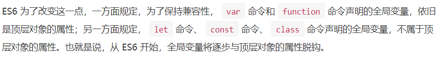

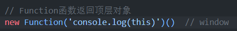

[**Function 常用方法**](https://blog.csdn.net/m0_60459392/article/details/126152651)

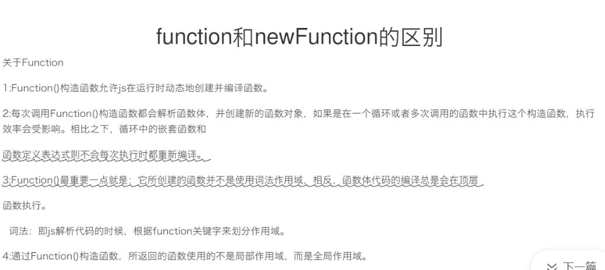

# 2 变量的解析重构

## 2.1 数组的解析重构

1. **默认值**

   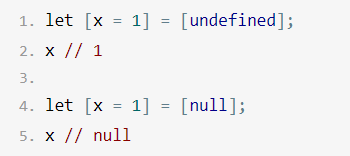

   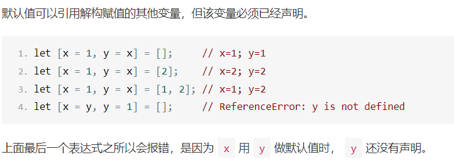

2. **...  (对象的扩展运算符)**

   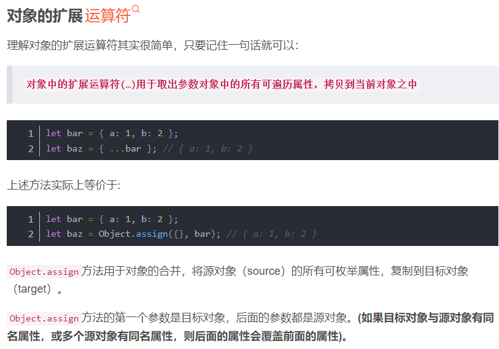

   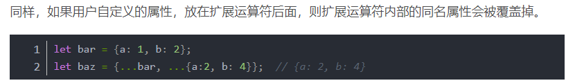

   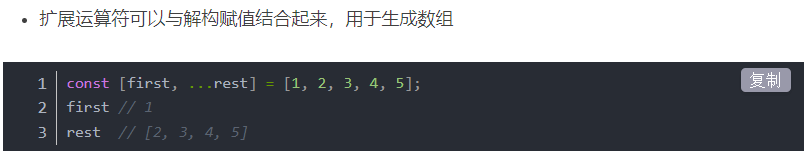

   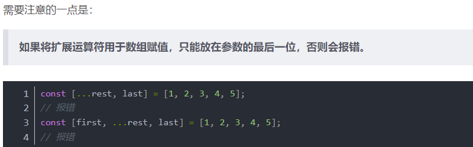

## 2.2 对象的解析重构

1. **可以取出内置对象的原有方法**

   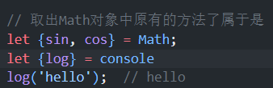

2. **必须要有对应名才能取出**

   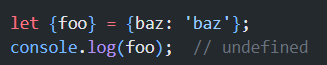

3. **变量名与属性名不一致**


# 12. Symbol

## 12.1 作为属性名的Symbol

> + **在对象的内部，使用 Symbol 值定义属性时，Symbol 值必须放在方括号之中**
>   + 如果`s`不放在方括号中，该属性的键名就是字符串`s`，而不是`s`所代表的那个 Symbol 值

## 12.* 对象中的Symbol

```js
// 1.先在外部定义say, 在移入对象中
let say = Symbol('say');
let game = {
    name: '狼人杀',
    // 不加 [], 会被认为是window中的symbol
    [say]: function() {
        console.log('i can say');
    },
    // 2.在game中用Symbol.for, 在外部调用
    [Symbol.for('fly')]: function() {
        console.log('fly the mount');
    }
}
//调出方法1
game[say]();  // i can say

//调出方法2
let fly = Symbol.for('fly');
game[fly]();  // fly the mount
```


# 17 iterator & for...of

> + **Iterrator主要供for...of消费**
> + **原生具备Iterator接口的数据(可用for of 遍历)**
>   + Array
>   + Arguments
>   + Set
>   + Map
>   + String
>   + TypeArray
>   + NodeList
> + **工作原理 :**
>   + 创建一个**指针对象**, 指向当前数据结构的起始位置
>   + 第一次调用对象的next方法, 指针自动指向数据结构的第一个成员
>   + 然后**不断调用next方法**, 指针一直往后移动, 直到指向最后一个成员
>   + 每调用next方法返回一个包含value和done属性的对象

```js
        const xiyou = ['唐僧', '孙悟空', '猪八戒', '沙僧'];
        // 1.for...of
        for (let v of xiyou) {
            console.log(v);
        }  // ['唐僧', '孙悟空', '猪八戒', '沙僧']

        let iterator = xiyou[Symbol.iterator]();
        console.log(iterator);

        // 调用对象的next方法
        console.log(iterator.next());  // done: false, 表示遍历未结束
        console.log(iterator.next());
        console.log(iterator.next());
        console.log(iterator.next());
        console.log(iterator.next()); // 遍历完之后为undefined, done: true, 表示遍历结束
```

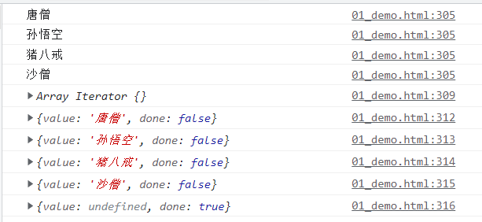

## 17.* 自定义遍历数据

```js
const banji = {
    name: 'kaka',
    stu: [
        'xixi',
        'haha',
        'dada',
        'lili'
    ],
    // 对象里创建Iterator, 让对象可以用for of遍历数组
    // 此时对banji做 for of 遍历, 相当于遍历[Symbol.iterator]()对象
    [Symbol.iterator]() {
        // 索引变量
        let index = 0;
        /*
            此处_this相当于:
            return {
                next: () => {
                    if (index < this.stus.length) {
                        return {value: this.stus[i], done: false}
                    }
                }
            }
        */
        let _this = this;
        return {
            next: function() {
                if (index < _this.stu.length) {
                    const result = {value: _this.stu[index], done: false}
                    // 下标自增
                    index++;
                    // 返回结果
                    return result;
                } else {
                    return {value: undefined, done: true}
                }

            }
        };
    }
}
console.log(banji);
for (let v of banji) {
    console.log(v);
}
```

## 17.* 生成器函数

> **生成器就是一个特殊函数**
>
> **之前异步编程: **  **(纯回调函数形式)**
>
> + **node**
> + **fs**
> + **ajax**
> + **mongodb**

```js
    // 生成器是一个特殊的函数
    // 异步编程 纯回调函数 node fs ajax mongodb
    // 生成器

    // yield  函数代码的分割符, 由next方法执行
    function* gen() {
        console.log('hello generator');
        console.log(111);
        yield '这是yield头部';
        console.log(222);
        yield '这是yield中间';
        console.log(333);
        yield '这是yield尾部';
        console.log(444);
    }
    let iterator = gen();
    console.log(iterator);
    // 必须调用next()方法, 才能运行
    iterator.next();
    iterator.next();
    iterator.next();
    iterator.next();

    console.log('-----------------------------');
    //遍历 next方法可由 for of遍历
    for (let v of gen()) {
        console.log(v);
    }
```

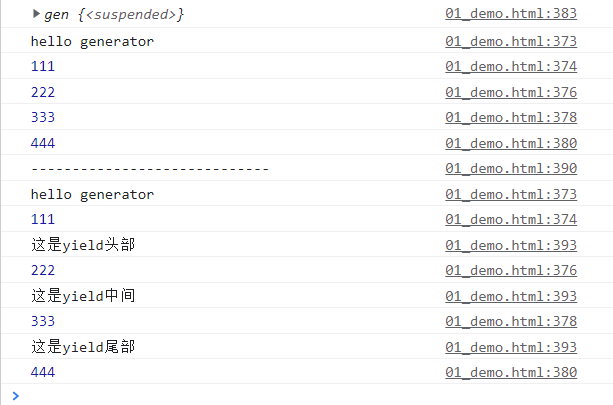


# 21.Class 的基本语法

```js
// 函数
function Point(x, y) {
    this.x = x;
    this.y = y;
}

// 类似构造函数 (本质是语法糖)
class Point {
    // 其中 constructor方法 类似功能类似 上面 构造函数
    constructor(x, y) {
        this.x = x;
        this.y = y;
    }

    toString() {
        return '(' + this.x + ',' + this.y + ')';
    }
}

// -----------------------------------------------
// 下述代码中, b是B的实例, ta的constructor方法就是B类 原型的 constructor方法
class B {}
let b = new B();

b.constructor === B.prototype.constructor // true

// ------------------------------------------------
// 构造函数的prototype属性，在 ES6 的“类”上面继续存在。事实上，类的所有方法都定义在类的prototype属性上面。
class Point {
  constructor() {
    // ...
  }
  toString() {
    // ...
  }
  toValue() {
    // ...
  }
}
// 等同于
Point.prototype = {
  constructor() {},
  toString() {},
  toValue() {},
};


```

# 23. Moudule语法

## 23.1 import()

> + **import: 放在模块顶层, 不能放在代码块中(无意义), 编译时加载**
>   + **export相似**
>   + **require是运行时加载模块 (动态加载)**
>
> + **import(): 支持动态加载模块, 可放在事件中**
>   + **import() 类似 require, 不同点: *require同步加载*, *import()异步加载***

```js
// import()
// 1.允许模块路径动态生成
import (f())
.then(...);  // 根据f的返回结果, 加载不同模块
      
// attention: import()加载模块成功以后，这个模块会作为一个对象，当作then方法的参数。因此，可以使用对象解构赋值的语法，获取输出接口。
// export1, export2都是myModule.js的输出接口, 可解构直接获得
import('./myModule.js')
.then(({export1, export2}) => {
    // ...
})
```

```js
// 2.若模块又default输出接口, 可用参数直接获得
import('./myModule.js')
.then(myModule => {
    console.log(myModule.default);
})

// 或, 具名输入
import('./myModule.js')
.then(({default: theDefault}) => {
    console.log(theDefault);  // 改名了属于是
})
```

```js
// 3.加载多个模块
Promise.all([
    import('./module1.js'),
    import('./module2.js'),
    import('./module3.js'),
])
.then(([module1, module2, module3]) => {
    ...
})
```

```js
// 4.用在async函数中
async function main() {
    const myModule = await import('./myModule.js'); // 把import()改为同步
    const {export1, export2} = await import('./myModule.js');
    const [module1, module2, module3] = 
          await Promise.all([
              import('./module1.js'),
              import('./module2.js'),
    		  import('./module3.js'),
          ])
}
main();
```

## 23.2 严格模式

> ES6自动采用严格模式
>
> 限制:
>
> - 变量必须声明后再使用
> - 函数的参数不能有同名属性，否则报错
> - 不能使用**`with`**语句
> - 不能对只读属性赋值，否则报错
> - 不能使用前缀 0 表示八进制数，否则报错
> - 不能删除不可删除的属性，否则报错
> - 不能删除变量`delete prop`，会报错，只能删除属性`delete global[prop]`
> - `eval`不会在它的外层作用域引入变量
> - `eval`和`arguments`不能被重新赋值
> - **`arguments`不会自动反映函数参数的变化**
> - 不能使用`arguments.callee`
> - 不能使用`arguments.caller`
> - **禁止`this`指向全局对象**
>   - *ES6 模块之中，顶层的`this`指向`undefined`，即不应该在顶层代码使用`this`。*
> - 不能使用`fn.caller`和`fn.arguments`获取函数调用的堆栈
> - **增加了保留字（比如`protected`、`static`和`interface`）**

```html
<!--with语句, 方便编写-->
<!--严格模式下不能使用with-->
<!--
	大量使用with, 会导致浏览器性能下降
	原因:
		以下面的代码为例子，我们使用with语句关联了document对象。这就意味着在with代码块内部，每个变量首先会被看作一个局部变量，如果局部作用域中找不到该变量那么就会查询与with关联的对象中是否有该变量。
-->
<div id = "one">这是one</div>
<div id = "two">这是two</div>
    
<script>
    with(document) {
        // 下面代码会先在{}把getElementById作为变量 / 方法查找, 找不到再在with()关联的对象中查找
        // 没有with() 下面代码会报错: Uncaught ReferenceError: getElementById is not defined
        let oneEl = getElementById('one');
        let twoEl = getElementById('two');
    }
    alert(oneEl.innerHTML);
    alert(twoEl.innerHTML);
</script>
```

## 23.3 export

```js
// export
// 1.输出变量
export {变量1, 变量2, ...}

// 2.输出类
export function funcName(x, y) {
    return x * y;
}
// 3.as关键字命名
function v1() {...}
function v2() {...}

// 以下, v2用as命名两次, 可以调用这两个不同的名称使用v2方法
export {
	v1 as streamV1,
    v2 as StreamV2,
    v2 as StreamLatesVersion
};
               
// attention: export规定的是对外接口,
	           // 报错
               export 1;
               // 报错 虽然通过m, 但还是直接输出1
               var m = 1;
           	   export m;
               
               // --------------------------------------
               // 正确写法1:
               export var m = 1;
               // 正确写法2:
               var m = 1;
               export {m};
               // 正确写法3:
               var n = 1;
               export {n as m}

               // --------------------------------------
               // 同样的, function 和 class的输出, 也要遵循此规则
               // error
               function f() {}
               export f;
               // right
               export functiono f() {};
               // right
               function f() {}
               export {f}
               
// --------------------------------------
// export语句输出接口, 与其对应的值是动态绑定关系, 可通过该接口, 取到模块内部实时的值
// 下述代码输出变量为foo, 值为'bar', 500ms后值变为'baz'
export var foo = 'bar';
set Timeout(() => foo = 'baz', 500);

// 另外, export命令可以出现在模块任何位置(只要在顶层模块就行, 同import), 不能放在代码块, 函数...中
```

## 23.4 import

> + **import接收export定义的模块接口**
>
> + **`import`命令具有提升效果，会提升到整个模块的头部，首先执行。**

```js
// 1.import 接收 './profile.js'文件
import {firstName, lastName, year} form './profile.js';

function setName(element) {
    element.textComtent = firstName + '' + lastName;
}
// 2.import 接收模块.变量后改名, 把lastName改名为surname
import {lastName as surname} from './profile.js';

// 3.import接收到的变量是只读的, 本质是输入接口, 不允许加载模块脚本里该接口 (改在export模块改)
	// 3.1 error (a是变量不可更改)-------------------------
	import {a} from './xxx.js'
	a = {}
	
	// 3.2 right (a是对象就能改)---------------------------
	import {a} from './xxx.js'
	a.foo = 'hello'  // valid
```

```js
// import是静态执行, 不能用表达式和变量, 在运行时才能得到结果
// so
	// error (用到的表达式)
	import {'f' + 'oo'} from 'my_module';

	// error (用到了变量)
	let module = 'my_module';
	import {foo} from module

	// error (用到了if结构)
	let (x === 1) {
        import {foo} = from 'module1';
    } else {
        import {foo} = from 'module2';
    }
```

```js
// 目前阶段，通过 Babel 转码，CommonJS 模块的require命令和 ES6 模块的import命令，可以写在同一个模块里面，但是最好不要这样做。因为import在静态解析阶段执行，所以它是一个模块之中最早执行的。下面的代码可能不会得到预期结果。
require('core-js/modules/es6.symbol');
require('core-js/modules/es6.promise');
import React from 'React';

// 另外, import两个同样的模块只会执行一次
import 'lodash'
import 'lodash'
// 上面只会执行一次

// 下列代码功能相同 (foo & bar 在两个语句中加载, 但对应同一个my_module实例, 即import语句是Singleton模式)
/*
	单例（Singleton）模式的定义：指一个类只有一个实例，且该类能自行创建这个实例的一种模式。例如，Windows 中只能打开一个任务管理器，这样可以避免因打开多个任务管理器窗口而造成内存资源的浪费，或出现各个窗口显示内容的不一致等错误。
*/
import {foo} from 'my_module';
import {bar} from 'my_module';
import { foo, bar } from 'my_module';
```

## 23.5 模块的整体加载

```js
// 通配 + 改名
import * as circle from './circle';
```

## 23.6 export default 命令

```js
/*
	export default命令, 为模块指定默认输出, 其他模块加载该模块时, import命令可以为该匿名函数指定任意名字
*/
// export-default.js-------------------------------------
export default function() {
    console.log('foo');
}

// import-default.js-------------------------------------
// 改名为 customName
import customName from './export-default';
customName(); // 'foo'
```

```js
/*
	在export中函数add命名为default, 再在import时改名
*/
// modules.js--------------------------------------------
function add(x, y) {
  return x * y;
}

// ------------------------------------------------------
export {add as default};
// 等同于
// export default add;
// app.js
import { default as foo } from 'modules';
// 等同于
// import foo from 'modules';

// ------------------------------------------------------
// export default命令的本质是将后面的值，赋给default变量，所以可以直接将一个值写在export default之后。
// 正确
export default 42;
// 报错
export 42;
```

