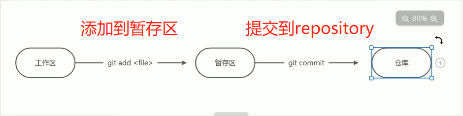

## 1. 基本配置

```markdown
# 配置用户邮箱
git config user.email "xxx@xx.com"
# 配置用户名
git config user.name "yourName"

# 对Download.zip 进行git初始化
git init

# git clone & Download.zip 区别就是克隆下载的文件 视作一个git仓库, 而Download下的文件只被看做是一个单纯的文件夹, git init之后才是仓库
```




## 2. add & commit

```markdown
# 添加到暂存区
git add -A
# 提交到repository, 并起名
git commit -m "提交信息"

# 查看提交历史
git log --stat

# 取消文件更改
git checkout 文件名

# 提交后撤回到上一次 (前退一次)
git reset Head^
```


## 3. 创建分支 & 合并

```markdown
# 查看当前分支
git branch

# 以当前分支为基础新建分支
git checkout -b 新分支名

# 列举所有分支
git branch

# 单纯地切换到某个分支 (回到想要去的分支)
git checkout 分支名

# 删除特定分支
git branch -D 分支名

# 合并分支 (一般在master下)
git merge 分支名

# 取消合并分支 (一般在master|MERGING状态下)
git merge --abort 
```

##  4. 远程仓库

```markdown
# 推送 (用于远程仓库同步本地修改)
git push

# 拉取 (用于本地仓库同步远程修改)
git pull
```

