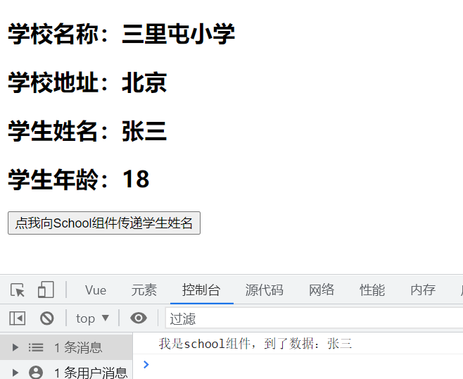

# 1. vue指令

## 1.1 v-text & v-html

> ```js
> 1. 值绑定
>     a. 插值表达式{{}}, 大括号里面可以展示data中的变量, 表达式, 函数调用;
>         其实就是vue编译环境 (类似js编码方式)
>     b. v-text & v-html 指令
>         二者区别:
>             当数据里有html字符串时, v-html能直接解析, 而v-text只会原字符串输出;
>             {{}}也是原字符串输出!
>         ps: 如何解决文本闪烁问题?
>         文本闪烁:
>             当加载vue.js文件不及时时, 会导致vue的语法无法被及时加载, 页面会显示vue的原始语法例如显示{{msg}}, 用户体验不好
>         解决方法: 
>             我们可以使用v-clock指令解决, 当vue.js文件没有加载完毕时, v-cloak会被是被为普通自定义属性, 我们让添加了该属性的元素display: none; 一旦vue.js加载完毕, v-cloak就会被vue是被为指令, 会自动去除之前display: none; 显示内容!
> ```


## 1.2 v-bind :

> ```js
> 2. 属性绑定
>     a. 语法
>         v-bind:属性名="vue编译环境"
>         简写  :属性名="vue编译环境"
>     b. 动态绑定style
>         语法:
>             :style="数组[] 或者 对象{} 或者 行间样式字符串"
>     c. 动态板顶class
>         语法:
>             :class="数组/对象"
>         class动态绑定较为常用, 一般都是 :class="{选择器名:布尔值}"
>         通过布尔值真假, 来设置是否需要该样式!
> ```


## 1.5 v-model

> ```
> 5. 双向数据绑定
>     vue默认数据绑定是单向的, 即model --> view(模型 --> 视图); 
> 当数据发生变化, 视图也会跟着更新
>     如果想要实现双向数据绑定, 需要 v-model指令!
>     
>     <fieldset>
>         <legend>
>         	<h2>双向数据绑定</h2>
>         </legend>
>         <h1>{{v}}</h1>
>         <input type="text" name="" id="" v-model:value="v">  
>     </fieldset>
> ```

## 1.6 v-if & v-show 

> ```
> 6. v-if & v-show
>     以上指令用在标签中, 最终形态都是标签是否显示!!,
>     为true, 显示标签; 为false, 隐藏标签!
>     v-if="布尔值", v-else来处理if为假的情况
>     v-show="布尔值", true显示, false隐藏
>     面试题:
>         v-if & v-show的区别?
>             v-if 显示/隐藏 元素是做DOM元素增删操作
>             v-show 显示/隐藏 标签是通过控制css中display属性
>             
>     (1) v-if, v-else-if, v-else 效果等同于:
>     	if().. else if().. else..
>     (2) v-if="false"是在dom层操作,
>     	v-show="false"是在css上操作, 类似display: none;
> ```


## 1.7 v-for

> ```
> 7.v-for循环渲染
>  语法:
>  遍历数组语法:
>      v-for(值, 下标) in 数组
>          为了保证vue将来在数据发生改变时重新渲染的正确性, 要求给每个循环的元素添加一个唯一的key值
>      key值的要求:
>          a. 优先从循环的数组值中去找
>          b. 保证唯一性, 数据类型只能是数字或者字符串
>          c. 当循环的数组值没有能充当key的属性, 再考虑元素下标
>  遍历对象语法:
>  	v-for="(value, key, index) in 对象"
>  循环数字:
>  	v-for="元素变量 in 数字"
>      例如:
>      	v-for="num in 100"
> ```

## v-cloak

> + **解决文本闪烁**

## 1.9 自定义滑动条

```html

<head>
    <meta charset="UTF-8">
    <meta http-equiv="X-UA-Compatible" content="IE=edge">
    <meta name="viewport" content="width=device-width, initial-scale=1.0">
    <title>Document</title>
    <!-- 开发环境版本，包含了有帮助的命令行警告 -->
    <script src="https://cdn.jsdelivr.net/npm/vue@2/dist/vue.js"></script>

    <style>
        * {
            padding: 0;
            margin: 0;
            list-style: none;
        }
        
        .wash {
            margin: 20px;
            margin-left: 200px;
        }
        .wash>li {
            display: inline-block;
            width: 80px;
            text-align: center;
            line-height: 40px;
            cursor: pointer;
        }
        .slide {
            width: 50px;
            height: 2px;
            position: absolute;
            left: 15px;
            top: 333px;
            background-color: deepskyblue;
            transition: left 0.3s linear;
        }

        .liStyle {
            color: yellowgreen;
        }

        
    </style>
</head>

<body>
    <div id="app">
        <div class="wash">
            <li v-for="(v,i) in arr" :key="i" @click="fun1(i)" :class="{liStyle:liNum===i ? true : false}">{{v}}</li>
            <div class="slide" :style="divStyle"></div>
        </div>
    </div>

    <script>
        let app = new Vue({
            el: '#app',
            data: {
                arr: ["洗脚", "按摩", "spa", "刮痧", "拔罐", "采耳", "马萨基", "推背"],
                divStyle: [{ left: "215px" }],
                liNum: 0,
            },
            methods: {
                fun1(b) {
                    this.divStyle[0].left = b * 80 + 215 + "px";
                    this.liNum = b;
                }
            },
        })

    </script>
</body>
```


# 2. methods

## 2.1 methods

> ```
> 3. 事件绑定
>     a. 语法
>         v-on: 事件名="函数名/函数名()/简单语句"
>         例如:
>             v-on:click="fun1"
>         注意:
>             (1) 绑定函数时, 函数名后面的小括号可加可不加, 取决于是否需要传递参数,
>         如果需要传递参数, 小括号必须加!
>             (2) 绑定函数时, 没加小括号, 系统默认第一个形参为事件对象, 也就是event对象
>             (3) 绑定函数时, 加了小括号, 需要通过手动传入 $event获取事件对象
>             (4) 事件对象中, 可以直接用 this.变量名 访问data中的数据源变量, 通过 this.函数名() 
>         来直接调用本vue实例中的函数方法
>         简写:
>             @事件名="函数名/函数名()/简单语句"
> ```


## 2.2 事件修饰符

> ```
> 4. vue的事件修饰符 (阻止冒泡, 取消默认事件...)
>     我们在处理事件的逻辑时, 有一些常用的且书写固定的方法, vue觉的没有必要写的过于复杂, 
> 应该有更好的方式快速实现
>     语法:
>         @事件名.修饰符="函数"
>         例如:
>             阻止冒泡 @click.stop="函数名"
>         a. 普通事件修饰符
>             阻止冒泡事件传播: stop
>             阻止默认事件执行: prevent
>             一次性事件(只能走一次) once
>         b. 键盘事件修饰符
>             left, right, up, down, enter, tab, ctrl, space, shift, alt等
>         或者直接写keyCode值
>         c. 鼠标事件修饰符
>             left, middle, right
> ```

## 2.3 自定义轮播图

```html
<head>
    <meta charset="UTF-8">
    <meta http-equiv="X-UA-Compatible" content="IE=edge">
    <meta name="viewport" content="width=device-width, initial-scale=1.0">
    <title>Document</title>
    <!-- 开发环境版本，包含了有帮助的命令行警告 -->
    <script src="https://cdn.jsdelivr.net/npm/vue@2/dist/vue.js"></script>

    <style>
        * {
            padding: 0;
            margin: 0;
            list-style: none;
        }
        
        ul {
            margin: 50px;
            margin-left: 302px;
            height: 200px;
            width: 450px;
            position: relative;
        }

        ul>li {
            position: absolute;
            z-index: 1;
        }

        img {
            height: 200px;
            width: 450px;
        }

        .active {
            z-index: 52;
        }

        button {
            border: none;
            background-color: rgba(250, 94, 188, 0.597);
            height: 20px;
            width: 20px;
        }

        button:hover {
            cursor: pointer;
        }

        .left-btn {
            position: absolute;
            top: 128px;
            left: 302px;
            z-index: 520;
            border-radius: 0 15px 15px 0;
        }

        .right-btn {
            position: absolute;
            top: 128px;
            left: 732px;
            z-index: 520;
            border-radius: 15px 0 0 15px;
        }

        .all-btn {
            position: absolute;
            z-index: 520;
            top: 227px;
            left: 463px;
        }

        .all-btn>button {
            margin-right: 10px;
            text-align: center;
        }
     
    </style>
</head>

<body>
    <div id="app">
        <ul @mouseenter="mouseEnter" @mouseleave="mouseLeave">
            <li v-for="i in count" :key="i" :class="{active: flag === i}"></li>
        </ul>
        <button class="left-btn" @click="leftBtn"></button>
        <button class="right-btn" @click="rightBtn"></button>
        <div class="all-btn">
            <button v-for="i in count" :key="i + 5" @click="allBtn(i)">{{i}}</button>
        </div>
    </div>

    <script>
        let app = new Vue({
            el: '#app',
            data: {
                count: 5,
                flag: 1,
                timer: null,
            },
            methods: {
                mouseLeave() {
                    console.log('点了');
                    this.timer = setInterval(() => {
                        console.log('我敲');
                        this.flag++;
                        if (this.flag === 6) {
                            this.flag = 1;
                        }
                    }, 2000)
                },
                mouseEnter() {
                    clearInterval(this.timer);
                },

                leftBtn() {
                    this.flag--
                    if (this.flag === 0) {
                        this.flag = 5
                    }
                },
                rightBtn() {
                    this.flag++
                    if (this.flag === 6) {
                        this.flag = 1;
                    }
                },
                allBtn(value) {
                    this.flag = value;
                }
            },
        })

    </script>
</body>

</html>
```

# 3. computed

> ```
> 计算属性
> 
> 	模板内的表达式非常便利, 但是设置它们的初衷是用于简单数据展示, 一旦在模板中放入太多逻辑运算, 会导致模板冗杂且难以维护, vue建议当模板内有复杂逻辑需要处理时, 可以使用计算属性.
> 	计算属性, 是属性操作, 不是函数操作!!
> ```
>
> 1. **计算属性时基础数据的响应式依赖进行缓存的, 其中的数据发生变化, 计算属性才会重新加载更新!**
>
> 2. **计算属性如果直接写成函数形式, 默认执行的是该计算属性的get方法**
>
> 3. **计算属性既可以基础data数据, 也可以基础props(父子组件传值)属性**
>
> 4. **计算属性不能存在异步代码**
>
> 5. **计算属性的目的是进行复杂运算, 并且得到计算结果**
>
> 6. **计算属性名自定义即可, 尽量见名知意, 它只为数据服务, 不需要和data中的数据属性同名**
>
> 7. **计算属性的完整写法是一个对象, 其中包含set和get方法, vue会跟我们对计算属性的操作使用, 来自动调用对应的set或get方法**

```js
            // 计算属性
			// 计算属性只有相应的data/props中属性调用才执行
			
            computed: {
            	// 写法1    
                reverseMsg: function () {
                    return this.msg.split('').reverse().join('');
                },
                // 写法2
                aPlusC() {
                    console.log('计算属性: computed a + c');
                    return this.a + this.c;
                },
                bPlusC() {
                    return this.b + this.c;
                },
                // 写法3, 完全写法, 不写set & get方法默认执行get方法
        		// set方法传参, get方法返回值return        
                fullName: {
                    set(newName) {
                        this.lastName = newName;
                    },
                    get() {
                        return this.firstName + '·' + this.lastName;
                    }
                }
            },
```


# 4. arr & obj 监测

> ```
> Vue中数组和对象的监测
> 
> 1. 对数组的监测
>     以下方法会影响原数组:
>         push, pop, unshift, splice, reverse
>     以下方法生成一个新数组, 不会影响原数组:
>         join, concat, filter, map, splice
>     a. 数组的操作但凡是能直接影响原数组的, 都会引起页面的直接更新;
> 不改变原数组的而是返回新数组的, 页面都不会更新, 除非对数组赋值
>     b. 直接通过下标修改数组中的元素, 也不会引起页面的更新
> 
>     解决方法:
>         (1) 重新覆盖数组, 参考...析构
>         (2) Vue.set(数组, 下标, 新值)
>         (3) vue实例对象.$set(数组, 下标, 新值)
> 
> 2. 对对象的监测
>     a. 直接修改对象的属性值, 会引起页面更新
>     b. 直接替换掉对象, 其实就相当于重新给对象赋值, 也不会引起页面的更新
>     c. 但是给对象增加键值对, 不会引起页面刷新
> 
>     解决方案:
>         (1) Vue.set(对象, 新key, 新value)
>         (2) vue实例对象.$set(对象, 新key, 新value)
>         (3) 原对象=Object.assign({}, 原对象, 新增键值对对象)
> ```

## 4.1 数组监测

```js
        //数组监测主要就是复杂数据类型共同特点, 地址引用而非值引用
		let app = new Vue({
            el: '#app',
            data: {
                arr1: [100, 300, 500, 900],
            },
            methods: {
                pushAction() {
                    this.arr1.push(Math.floor(Math.random() * 100));
                },
                filterAction() {
                    // filter会返回一个新数组
                    // 若使this.arr1刷新, 需将生成新数组赋给this.arr1, 如下:
                    this.arr1 = this.arr1.filter((num) => num > 300);
                },
                changeValueAction() {
                    // 修改数组
                    this.arr1[2] = 666;
                    // 控制台this.arr1确实改变, 但由于数组地址, 长度等未变化, vue不认为this.arr1变化
                    console.log(this.arr1);

                    // 解决方法:
                    // 方式1 析构
                    this.arr1 = [...this.arr1];

                    // 方式2 全局更新
                    Vue.set(this.arr1, 2, 10000);

                    // 方式3 当前实例对象 更新
                    app.$set(this.arr1, 3, 20000);
                }
            },
        })
```


## 4.2 对象监测

```js
		let app = new Vue({
            el: '#app',
            data: {
                person: {
                    name: '卡卡',
                    sex: '男',
                    age: 18
                },
            },
            methods: {
                // 对象
                changePerson() {
                    this.person.sex = '确实是男';
                },
                addKeyValue() {
                    // this.person.address = '成都';
                    // Vue.set
                    
                    // 
                    Vue.set(this.person, 'address', '成都');

                    // app.$set
                    app.$set(this.person, 'school', '清华大学');

                    // Object.assign()
                    this.person = Object.assign({}, this.person, {
                        phone: '55151555',
                        hobby: '就是玩儿'
                    })

                    console.log(this.person);
                },
                replaceObj() {
                    // 替换 其实就是给对象赋值
                    this.person = {
                        a: 12,
                        b: 'hhh',
                        c: [
                            { some: 'thing' },
                            { orange: 'juice' }
                        ]
                    }
                }
            },
        })
```

# 5. watch

> ```
> 侦听器watch
>     观察一个值, 当被监听的值发生了变化, 我们知道其发生了什么改变, 进而进行一些操作,
> watch就像一个观察动作, 只要值变了, 就立马执行watch
>         a. 
>         b. 所以
>         c. 
>         d. watch写成对象形式, 对象可以有以下字段:
>             (1) handler(newV, oldV){}函数, 当侦听的数据发生变化会执行的回调函数
>             (2) immediate 布尔值, 如果设置为true, 网页运行时会先执行一遍侦听回调函数
>             (3) deep, 布尔值, 深度侦听! 只有监听的数据是对象类型时有用, 设置为true时,
>         哪怕修改了对象的某个属性, watch也能侦听到
> ```
>
> 1. **注意, watch观察值一定是已存在的数据, 所以其只能观察data或者props中的数据, **
> 2. **watch中的属性名不可以随便写, 必须是data或者props中的属性名**
> 3. **watch写成函数形式, 函数名就是要观察的属性, 并且携带两个参数, 最新的数据new和变换之前的数据old**

```js
    watch: {
        firstName(newV, oldV) {
            console.log(newV, oldV);
        },

        stu: {
            handler(newV, oldV) {
            	console.log('监听stu```````:', newV, oldV);
       		},
            // deep属性能监听到对象的属性变化, 但是由于对象是复杂数据类型, 修改属性在同一个内存地址, 地址引用相同
            // 因此, 能监听到stu.name改变, 但获取的数据不对
            deep: true
         },
         // 直接监听stu.name
         'stu.name'(newV, oldV) {
         	console.log('直接监听stu.name: ', newV, oldV);
         }
    }
```

# 6. 生命周期

> 1.  **vue实例创建:**
>    1. **beforeCreate()**
>    2. **created()  --  网络请求**
> 2. **vue实例挂载:**
>    1. **beforeMount()**
>    2. **mount()  --  DOM创建完毕**
> 3.  **vue数据更新:**
>     1.  **beforeUpdate()**
>     2.  **updated()**
> 4.  **vue实例销毁:**
>     1.  **beforeDestroy()**
>     2.  **destroyed()**

```js
    // 生命周期
    // 声明周期函数都是随着组件加载自动触发, 无需手动调用
    // 1.
    beforeCreate() {
        // vue实例创建之前会触发, 此时, 无法获取data数据
        console.log('beforeCreate触发!', this.msg);
    },
    // 2.
    created() {
        // 组件创建完毕之后触发, 此时可以获取data数据, DOM还未创建好
        // 网络请求在此获取
        console.log('created触发!', this.msg, h2);
    },
    // 3.
    beforeMount() {
        // vue实例挂载之前触发, 可以获取data数据, DOM还未创建好
        console.log('beforeMount触发!', this.msg, h2);
    },
    // 4.
    mounted() {
        // vue实例挂载完毕之后触发, 可以获取data数据, DOM创建好了
        console.log('mounted触发!', this.msg, h2);
    },
    // 数据更新-----------
    // 此后 DOM都可以获取
    // 5 
    beforeUpdate() {
        // data数据源只要被修改, 此函数就会触发, 但是页面还未更新
        console.log('beforeUpdate触发!', this.msg, h2);
    },
    updated() {
        //data数据源已经被修改，并且页面更新完毕
        console.log("updated")
    },
    // 7.
    beforeDestroy() {
        // vue实例销毁前触发, 一般在此做数据保存, 缓存请求, 解绑事件监听, 销毁计时器等
        console.log('beforeDestroy触发!');
    },
    // 8.
    destroyed() {
        // vue实例已经被销毁, 该函数调用之后, 当前vue实例所有指令解绑,
        // 所有监听移除, 所有子实例也会被销毁
        console.log('destroyed触发');
    }
```


# 7. 组件间通信

## 7.1 父 --> 子

> ***props***

```js
// 父组件向子组件传值, 直接在子组件上采用属性传值, 传到子组件上的属性值存入到子组件的props中
// 父向子传-------
    <div id="app">
        <fieldset>
            <legend>
                <h2>这是根组件</h2>
                <h2>{{sendChild1}}</h2>
            </legend>
            <child1 :app_msg="sendChild1" :get_arr="sendArr" :get_obj="sendObj"></child1>
        </fieldset>
    </div>

// 子------
let child1 = {
    template: '#child1',
    data: function () {
        return {

        }
    },
    props: {
        // 标准写法
        app_msg: {
            type: String,
            default: 'default',
        },
        // 简便写法
        get_arr: [],
        get_obj: {}
    },
    methods: {

    },
    computed: {

    }
}

// 父--------------
new Vue({
    data: function () {
        return {
            sendChild1: '这是来自爸爸的问候',
            sendArr: ['hp', 'fg', '哒哒哒'],
            sendObj: {
                name: '阿涛',
                age: 21
            }
        }
    },
    // 组件
    components: {
        'child1': child1
    }
}).$mount('#app');
```


## 7.2 子 --> 父

> **自定义事件: $emit(事件名1, 实参值1, 实参值2, ...)**

> ***本质上还是函数的实参传值给形参, 就决定了在子组件中调用函数传入是实参, 在父组件中定义函数用形参接收实参***

```js
    <div id="app">
        <fieldset>
            <legend>
                <h2>子组件</h2>
            </legend>
            <h2>来自子组件的传值: {{msg}}</h2>
            <h2>数字: {{num}}</h2>
        </fieldset>

        <!--    给组件绑定  自定义事件!  注意:之前我们给标签绑定click,mouseenter等这些都是系统提供的通过鼠标点击触发的! 但是自定义事件需我们主动触发!!-->
        <child1 @c1_event="getC1Msg"></child1>
    </div>

    <template id="child1">
        <div>
            <legend>
                <h2>这是子组件</h2>
            </legend>
            <button @click="sendDataToApp">点击传值给他爹</button>
        </div>
    </template>

// 子----------
let child1 = {
    template: '#child1',
    data: function () {
        return {
            child1Msg: '这是子组件的值, data'
        }
    },
    methods: {
        sendDataToApp() {
            // 调用函数--传入实参--实参会传值给形参
            // 触发自定义事件, 只要触发事件, 那么与实践绑定的函数会执行
            // $emit(事件名1, 实参值1, 实参值2, ...)
            this.$emit('c1_event', this.child1Msg, 666);
        }
    }
}

// 父----------
new Vue({
    data: function () {
        return {
            msg: '',
            num: 0
        }
    },
    methods: {
        // 实参1为传到a, 实参2传到b
        getC1Msg(a, b) {
            console.log(a, b);
            this.msg = a;
            this.num = b;
        },
    },
    components: {
        'child1': child1
    }
}).$mount('#app');
```


## 7.3 兄弟 --> 兄弟

### 7.3.1 通过父组件中介

```js
// Child1中触发sendDataToChild2点击事件触发自定义事件c1_event传值到父组件, 在由父组件传属性传值到Child2的props中
<div id="app">
        <fieldset>
            <legend>
                <h2>父组件</h2>
            </legend>
            <h2>来自子组件的传值: {{appMsg}}</h2>
        </fieldset>
        <child1 @c1_event="getDataChild1"></child1>
        <child2 :c2_msg="appMsg"></child2>
    </div>

    <template id="child1">
        <div>
            <legend>
                <h2>这是child1</h2>
            </legend>
            <button @click="sendDataToChild2">点击传值给兄弟</button>
        </div>
    </template>


    <template id="child2">
        <div>
            <legend>
                <h2>child2</h2>
            </legend>
            <h1>接收来自兄弟组件child1的值: {{c2_msg}}</h1>
        </div>
    </template>
```

### 7.3.2 refs组件间传值

> **在任意组件中, 都能获取本组件的父组件或者根组件!**
>
> 1. **this.$parent 获取的是本组件的父组件实例**
>
> 2. **this.$root 获取的是本组件的根组件实例**

> **给子组件设置ref属性, 并且设置唯一识别的值!**
>
> **在父组件中通过this.$refs.组件唯一识别值, 在父组件中获取**

```js
    <!-- 父 -->
    <div id="app">
        <fieldset>
            <legend>
                <h2>父组件</h2>
            </legend>
            <h2>child传来的num: {{appNum}}</h2>
            <child1 ref="c1"></child1>
            <child2 ref="c2"></child2>
            <button @click="getChildren">点击获取子组件</button>
        </fieldset>
    </div>


    <!-- child1 -->
    <template id="child1">
        <div>
            <legend>
                <h2>这是child1</h2>
            </legend>
            <h2>{{c1_msg}}</h2>
            <button @click="getParent">点击获取父组件</button>
        </div>
    </template>


    <!-- child2 -->
    <template id="child2">
        <div>
            <legend>
                <h2>child2</h2>
            </legend>
        </div>
    </template>

// Child1----------
let child1 = {
    template: '#child1',
    data: function () {
        return {
            c1_msg: '',
            c1_num: 100,
        }
    },
    methods: {
        getParent() {
            console.log(this.$parent);
            console.log(this.$root);
            // 访问父组件data
            console.log(this.$parent.msg);
            this.c1_msg = this.$parent.msg
            this.$parent.appFun1(this.c1_num)

            // 在child1中获取child2
            console.log(this.$parent.$refs.c2.child2Msg);
        }
    },
}

// Chil2-----------
let child2 = {
    template: '#child2',
    data: function () {
        return {
            child2Msg: '这是child2...'
        }
    },
    // 接收父组件传值
    props: ['']
}

// 父--------------
new Vue({
    data: function () {
        return {
            appMsg: '',
            msg: '这是个空',
            appNum: 0
        }
    },
    components: {
        'child1': child1,
        'child2': child2
    },
    methods: {
        appFun1(num) {
            this.appNum = num;
        },
        getChildren() {
            console.log(this.$refs.c1.c1_num);
        }
    }
}).$mount('#app');
```

## 7.4 全局事件总线

> 1. **原理是给 Vue 的原型对象上面添加一个属性。这样的话我所有组件的都可以访问到这个属性，然后可以通过这个属性来访问其他组件给这个属性上面绑定的一些方法，从而去传递数据。而且这个属性还可以去访问 Vue 实例对象上的方法。因为 Vue 组件构造函数的原型对象的原型对象是指向 Vue 的原型对象的**
> 2. **使用步骤:**
>    1. **安装全局事件总线**
>    2. **.接收数据：A组件想接收数据，则在A组件中给 $bus 绑定自定义事件，事件的`回调留在A组件自身`**
>    3. **提供数据：`this.$bus.$emit( " xxx",数据)`**
>    4. **最好在`beforeDestroy`钩子中，用`$off`去解绑当前组件所用到的事件**

```js
// main.js中----------------------------------------------
//引入Vue
import Vue from 'vue';
//引入App
import App from './App';

//关闭vue的生产提示
Vue.config.productionTip = false

//创建vm
new Vue({
    el: "#app",
    render: h => h(App),
    beforeCreate() {
        Vue.prototype.$bus = this//安装全局事件总线
    }
})

// School.vue中给$bus绑定hello事件--------------------------
<template>
  <div class="school">
    <h2>学校名称：{{ name }}</h2>
    <h2>学校地址：{{ address }}</h2>
  </div>
</template>

<script>
export default {
  name: "School",
  data() {
    return {
      name: "三里屯小学",
      address: "北京"
    }
  },
  mounted() {
    //给$bus绑定hello事件
    this.$bus.$on("hello", (data) => {
      console.log("我是school组件，到了数据：" + data);
    })
  },
  beforeDestroy() {
    // 组件销毁, hello事件
    this.$bus.off("hello")
  }
}
</script>

// Student.vue中触发事件-----------------------------------
<template>
  <div class="student">
    <h2>学生姓名：{{ name }}</h2>
    <h2>学生年龄：{{ age }}</h2>
    <button @click="sendStudentName">点我向School组件传递学生姓名</button>
  </div>
</template>

<script>
export default {
  name: "Student",
  data() {
    return {
      name: "张三",
      age: 18
    }
  },
  methods:{
    sendStudentName(){
      this.$bus.$emit("hello",this.name)
    }
  }
}
</script>
```



# 8. 路由 & 组件 & 插槽

> + **返回上一级路由**
>   + `this.$router.go(-1) 原页面中的数据会丢失,因为会刷新页面`
>   + `this.$router.back() 原页面中的数据会保留`
>   + `this.$router.back(0) 刷新`
>   + `如果使用历史路由模式, window.history.go(-1) 返回浏览器的上一条链接页面`

> **active-class="类名"  ----  router-link标签点击选中切换效果**

## 8.1 路由传值

> 1. **query传值:**
>    1. **切换的路由传值由字符串转为对象 {path: '路由路径', query: {值}}**
>    2. **query方式传值, 最终参数会被拼接到网络地址后面?参数名=参数值&参数名=参数值...**
>    3. **query方式传递的参数, 页面刷新时, 数据不会丢失**
>    4. **query方式传值, 不需要再次修改路由配置信息**
> 2. **params传值:**
>    1. **搭配name属性, {name: '路由配置name值', params; {值}}**
>    2. **params传值, 如果不修改路由配置信息, 那么在页面信息时数据会丢失, 若想要保存数据, 需要在路由配置文件中将path路径改为/路由/:属性1/:属性2...**
>    3. **修改之后的路由路径在网络地址栏中会变/路由/值1/值2...**

```vue
// 1. query传值-------------------------------------------

// 直接在标签传
<!-- 路由传值 query-->
<!-- 路由传值: path, query -->
<router-link :to="{path: '/product', query: {proName: '哑铃', proPrice: '38'}}" active-class="active">商品
</router-link>

// methods中传值
methods: {
    toProduct() {
    // $router赋值路由跳转, $route路由传值
    // this.$router.push('/product').catch(() => {}) methods中传值会报错, 用catch()捕获即可!
     this.$router.push({path: '/product', query: {proName: '秋天的最后一杯奶茶', proPrice: '19'}}).catch(() => {})
    },
}

// 取值:
this.$route.query.属性名

```

```vue
// 2. params传值------------------------------------------

// router.index中-----------------------------------------
{
    // 默认params传值方式, 刷新页面值不会保存!
    // 如果刷新页面值还在, 需要给路由设置以下信息, 也是为什么要name属性的原因
    // /路由/: 属性名/: 属性名/
    path: '/child1/:id/:name/:price/:count',
    name: 'child1Name',
    component: () => import('../views/Child1')
}

// 直接在标签上传
<!-- 路由传值: name, params: {传值} -->
<router-link :to="{name: 'child1Name', params: {id: '123', name: '饺子', price: '88', count: '5'}}" active-class="active">Child1</router-link>

// methods中传值
toChild1() {
     // $router赋值路由跳转, $route路由传值
     // this.$router.push('/product').catch(() => {})
     this.$router.push({name: 'child1Name', params: {id: '1233', name: '黯然....', price: '18', count: '82'}}).catch(() => {})
}
```


## 8.2 辅助路由(命名路由)

> **辅助路由实现, 同一页面不只有一个路由插座效果**

```vue
// router-link--------------------------------------------
<section>
    <router-link to="/news">新闻列表</router-link>
    <router-link to="/imgs">图片列表</router-link>
</section>

// router-view--------------------------------------------
<div>
    // 对应default
    <router-view></router-view>
    // 对应a
    <router-view name="a"></router-view>
</div>
```

```js
// router.index中-----------------------------------------
{
    path: '路由1',
    components: {
        // default字段名对应没有name值的router-view
        default: () => import('..位置');
        // 其余字段, 需要与展示的插座name值保持一致
        a: () => import('..位置')
    }
}
```

## 8.3 守卫路由

> **通过跳转或取消跳转来守卫导航**

### 8.3.1 全局守卫

```js
// router.index中-----------------------------------------

// 全局前置守卫(钩子)---------------------------------------
// 全局前置守卫, 会捕捉所有路由切换, 并在切换之前触发
// to: Route: 将要进入的目标路由对象(要去)
// from: Route: 当前导航正要离开的路由(当前)
// next: Function: 一定要调用该方法来resolve这个钩子, 执行效果依赖next方法的调用参数

router.beforeEach((to, from, next) => {
  console.log('全局前置守卫执行了', to, from)
  // 进入
  if (to.path === '/page2') {
    // 50%几率能进page2
    if (Math.random() > 0.5) {
      next()
    } else {
      // alert('运气不好!')
      confirm('fffff')
    }
  } else if (from.path === '/page3') {
    // 离开
    if (Math.random() > 0.5) {
      next()
    } else {
      // confirm 弹窗返回值 true/false
      let res = confirm('确定离开吗?')
      if (res) {
        console.log('res????', res);
        next()
      }
    }
  } else {
    next();  // 一定调用next给路由放行
  }
})

// 全局后置守卫 (钩子)--------------------------------------
// 前置先走, 后置再走, 前置失败, 后置不走
// 全局后置守卫, 也会捕捉所有路由切换, 并在路由切换成功后触发
router.afterEach((to, from) => {
  console.log(`已经从${from.path}离开, 并已进入${to.path}`);
})

```

### 8.3.2 路由独享守卫

```js
// router.index中---------------------------------------
// 路由独享守卫 只能控制进入, 没有after

  {
    path: '/page2',
    component: () => import('../views/Page2'),
    //  路由元信息meta,键值对  用来对当前路由信息进行描述标记
    meta: {
      deep: 1, // 深度为1 表示1级页面
      index: 1
    },
    // 路由独享守卫, 进入前触发, 可以决定是否进入路由
    beforeEnter: (to, from, next) => {
      if (Math.random() > 0.5) {
        console.log('进来了');
        next()
      } else {
        // 没进2, 直接跳转进4-------------------------------
        console.log('这次没进, 我进page4');
        next('/page4')
      }
    }
  },
```

### 8.3.3 组件内守卫

```js
// 组件中--------------------------------------------------
// 组件内守卫
    /* 
        组件内守卫分3个:
            1. 进入组件之前
            2. 路由更新之前
            3. 离开组件之前
        当我们判断路由权限需要当前组件的数据源为辅助判断使, 可以考虑使用组件内守卫
     */
    beforeRouteEnter(to, from, next) {
        // 在渲染该组件的对应路由被验证前调用
        // 不能获取组件实例 `this` ！ (此时未进)
        // 因为当守卫执行时，组件实例还没被创建！
        next(_this => {
            // 给next建立一个回调以拿到当前实例(_this = this)
            console.log('进入组件前调用', _this);
        })
    },
    beforeRouteUpdate(to, from, next) {
        // 在当前路由改变，但是该组件被复用时调用
        // 举例来说，对于一个带有动态参数的路径 `/users/:id`，在 `/users/1` 和 `/users/2` 之间跳转的时候，
        // 由于会渲染同样的 `UserDetails` 组件，因此组件实例会被复用。而这个钩子就会在这个情况下被调用。
        // 因为在这种情况发生的时候，组件已经挂载好了，导航守卫可以访问组件实例 `this`
        console.log('组件被复用(更新)', this);
        next()
    },
    beforeRouteLeave(to, from, next) {
        // 在导航离开渲染该组件的对应路由时调用
        // 与 `beforeRouteUpdate` 一样，它可以访问组件实例 `this`
        console.log('离开组件时调用', this);
        next()
    },
```

## 8.4 动态组件

> **<component is="组件名"></component>**
>
> 路由或者动态组件,都是为了切换组件!并且无论哪种组件切换方式都会让组件频繁销毁和新建!
> 注意,无论是html标签,还是vue组件,或者自定义组件
>
> + **<组件名  :属性="vue编译环境"></组件名>**
> + **但凡需要访问vue编译环境,都必须进行绑定或者值绑定或者事件绑定!!!**

```vue
<template>
    <div class="message">
        <h1>这是消息组件</h1>
        <h2>动态组件</h2>
        <button @click="currentCom='Child1'">组件child1</button>
        <button @click="currentCom='Child2'">组件child2</button>
        <button @click="currentCom='Child3'"> 组件child3</button>
		<!--动态组件  is="组件名" 组件名是谁就显示哪个组件-->
		<!--根据点击事件, 确定currentCom选取那个组件进行切换-->
       <component :is="currentCom"></component>


    </div>
</template>

<script>
    // 1. 先导入要切换的组件
    import Child1 from "@/components/activeComponent/Child1";
    import Child2 from "@/components/activeComponent/Child2";
    import Child3 from "@/components/activeComponent/Child3";
    export default {
        name: "Message",
        data(){
            return{
                currentCom:"Child1"
            }
        },
        // 2. 将导入的组件写入component属性中
        components:{
            Child1, Child2, Child3
        }
    }
</script>

```

## 8.5 插槽slot

```vue
// MySlot-------------------------------------------------
<template>
    <div class="root">
        <h1>插槽</h1>
        
        // Child1-----------------------------------------
        <Child1>
<!--具名插槽  也就是给插槽起名字 并且对应标签模板展示新增内容-->
           	// 1. slot--s1
           <template v-slot:s1>
               <h3>child1中展示新闻</h3>
           </template>
			
			// 2. slot--s2
           <template v-slot:s2>
               <ul>
                   <li>列表1</li>
                   <li>列表2</li>
                   <li>列表3</li>
                   <li>列表4</li>
                   <li>列表5</li>
               </ul>
           </template>
			
			// 2. slot--s3--简写
            <template  #s3>
               <div class="box">
                <a href="###">京东</a>
                <a href="###">淘宝</a>
                <a href="###">天猫</a>
               </div>
            </template>
        </Child1>

		// Child2-----------------------------------------
        <Child2>
<!--作用域插槽,其实就是传值!!给插槽中的标签展示数据-->
<!--插槽传递的所有属性值,都被 allData这个自定义属性名获取!!!-->
            // 没有name属性, default
            <template v-slot="hhaha">
                <h3>{{hhaha.m2}}</h3>
                <h3>{{hhaha.m1}}</h3>
                <h3>{{hhaha.obj.name}}--{{hhaha.obj.sex}}---{{hhaha.obj.age}}</h3>
            </template>

            // 具名插槽, name = s1
            <template v-slot:s1="allData">
                <h3>{{allData.c1}}</h3>
                <h3>{{allData.c2}}</h3>
            </template>
        </Child2>
    </div>
</template>


// Child1-------------------------------------------------
<template>
    <fieldset>
        <legend><h2>这是child1组件</h2></legend>
        <h1>这是组件1</h1>
<!--如果组件重用率较高,就可以把重用部分封装在组件内! 不同地方使用插槽进行灵活展示!!-->

<!--插槽组件  灵活展示组件中新增内容-->
        <slot name="s1"></slot>
        <slot name="s2"></slot>
        <slot name="s3"></slot>
    </fieldset>
</template>


// Child2-------------------------------------------------
<template>
	<fieldset>
        <legend><h2>这是child2组件</h2></legend>
        <h2>组件2</h2>
    <!--没有name属性-->
        <slot :m2="msg2" :m1="msg1" :obj="obj"></slot>
    <!--带有具名插槽 进行传值-->
        <slot name="s1" :c2="count" :c1="num" ></slot>
	</fieldset>
</template>
```

## 8.6 keep-alive 组件

> 1. **keep-alive组件: 可以让其包裹的组件保持活性, 不被默认生命周期销毁, 减少组件的销毁频率, 提高页面运行效率**
> 2. **注意: 凡是被keep-alive组件包裹的组件, 不会再被销毁, 也就意味着其生命周期里的beforeCreate, created, beforeMount, mounted, beforeDestroy, destroyed不再执行**
> 3. **如果想要选择性缓存, 可以通过keep-alive的include或者exclude属性指定缓存哪些, 或者不缓存哪些**
>    1. **include  保活**
>    2. **exclude  不保活**

```vue
// 一共有 Cone, Ctwo, Cthree, Cfour
// 一次性包多个, 则加','
// 保活
<keep-alive include="Cone, Ctwo">
    <router-link></router-link>
</keep-alive>

// 不保活, 效果同上
<keep-alive exclude="Cthree, Cfour">
    <router-link></router-link>
</keep-alive>

// 可加变量------------------------
<keep-alive :include="str">
    <router-link></router-link>
</keep-alive>

data() {
	return {
		str: 'Cone, Ctwo'
	}
}

// 可用正则-----------------------
// C开头的都保活
<keep-alive :include="/^C[a-zA-Z0-9]+/">
    <router-link></router-link>
</keep-alive>
```


# 9. vuex

## 9.1 state

> 1. **state, Vuex中公共状态数据存放的位置, 它里面存储的数据就是将来需要被多个组件共享的数据, 数据可以是任意格式.**

```js
// store中state-------------------------------------------
  state: {
    cart: [
      {proName: 'apple', proPrice: '10'},
      {proName: 'banana', proPrice: '15'},
      {proName: 'orange', proPrice: '22'},
      {proName: 'watermelon', proPrice: '6'},
      {proName: 'peach', proPrice: '12'}
    ],
    count: 666,
    username: 'Jack'
  },
      
// PageOne中state-----------------------------------------
data() {
        return {
            c1: "122",
            msg1: "这是组件1",
        };
    },

//PageOne中vuex取值----------------------------------------
computed: {
	// 方式1, 普通取法: 取出vuex中的state
    getCart() {
        return this.$store.state.cart;
    },
}

// 方式2, 辅助函数取值: 取出vuex中的state
computed: mapState({
    // write1: 不推荐
    getCart: state => state.cart,
    
    // write2: 推荐, 'cart' 就是vuex中state的属性名
    getCart: 'cart',
    count: 'count',
    
    // write3: 访问本组件中data数据
    // 函数形态
    pageOne(state) {
        return parseInt(state.count) + parseInt(this.c1);
    }
})

// 方式3: 辅助函数, 简单形态, 展开操作符, 混入mapState辅助函数, 此函数就是帮我们便捷取state
computed: {
    getMsg() {
        return this.msg1 + 'ohohoh'
    },
    // vuex中mapState辅助函数
    ...mapState({
        getCart: 'cart',
        count: 'count'
    })
}
```

## 9.2 getters

> 2. **getters, 理解为Vuex中的计算属性, 如果将来我们需要在多个组件中使用state中的数据,
>    而且还需要对数据进行复杂处理, 此时我们可以选择将逻辑处理放在getters中完成, 这样就
>    不需要每个组件重复处理复杂逻辑.**

```js
// store中getters-----------------------------------------
getters: {
    pass: state => state.stuScore.filter(obj => obj.score >= 70),
    scoreGrand: (state, getters) => grand => {
      switch (grand) {
        case 'A': {
          return state.stuScore.filter(obj => obj.score >= 90);
        }
        case 'B': {
          return state.stuScore.filter(obj => obj.score >= 80 && obj.score < 90);
        }
        case 'C': {
          return state.stuScore.filter(obj => obj.score >= 70 && obj.score < 80);
        }
        case 'D': {
          return state.stuScore.filter(obj => obj.score < 70);
        }
        case 'P': {
          return getters.pass
        }
      }
    }
}

// PageTwo中computed--------------------------------------
computed: {
    // 常规写法
    getPass() {
        return this.$store.getters.pass;
    },
    // -------------------------------------------
    // getters中带有赋值操作, 建议写成常规形态, 不适用辅助函数
    veryGood() {
        return this.$store.getters.scoreGrand('A');
    },
    good() {
        return this.$store.getters.scoreGrand('B');
    },
    middle() {
        return this.$store.getters.scoreGrand('C');
    },
    laji() {
        return this.$store.getters.scoreGrand('D');
    },
    allPass() {
        return this.$store.getters.scoreGrand('P');
    },
    // 模块中的, 常规写法
    getModulesInnner() {
        return this.$store.getters['模块名/getter属性名']
    }
    // 推荐, 数组写法
    ...mapGetters([
        'pass', // 相当于计算属性名
    ]),
    // 或者键值对方式
    ...mapGetters({
        passScore: 'pass', // 键值对写法, key: value
    })
    
}
```

## 9.3 mutations

> 3. **mutations, 更改Vuex中数据的唯一方式, 我们在任意组件中通过提交mutation, 就可以修改state中的数据, Vuex中mutation非常类似组件中的事件methods.**
>    1. **mutations中只能做同步数据处理, actions做异步数据处理(也可做异步(效率低点))**

```js
// store中mutations---------------------------------------
mutations: {
  // 涨价操作, state位置是访问数据源, 不需要调用函数的时候传递此位置的实参
  upPrice(state) {
    state.cart.forEach(pro => {
      pro.proPrice++;
      pro.proPrice = pro.proPrice.toFixed(2);
    })
  },
  // 打折
  // 携带自定义参数, 提交载荷, 给自定义形参赋初始值, 如果有实参值就取实参值, 如果没有
  // n参数赋值, 就取值1
  downPrice(state, n = 0.9) {
    if (n > 1) {
      n = 1;
    }
    if (n < 0.2) {
      n = 0.2;
    }
    state.cart.forEach(pro => {
      pro.proPrice *= n;
      // 保留两位小数
      pro.proPrice = pro.proPrice.toFixed(2);
    })
  },
  // 修改幸运学生分数
  // 只有mutations 可以修改state数据!
  changeScore(state) {
    let index = Math.floor(Math.random() * 9);
    state.stuScore[index].score >= 90 ? state.stuScore[index].score = 100 : state.stuScore[index].score += 10;
  },
  setCurrentIndex(state, currentIndex) {
    state.currentIndex = currentIndex;
    console.log(state.currentIndex);
  }
},

// PageThree中methods-------------------------------------
methods: {
    // 常规用法
    upPrice() {
        this.$store.commit('upPrice', (此处可放参数(如果有的话))
    },
    // 辅助函数实现
    // 数组形态
    // ...mapMutations([
    //     'downPrice'
    // ]),
    // 键值对形态
    ...mapMutations({
        upPrice: 'upPrice',
        downPrice: 'downPrice'
    })
}
```

## 9.4 actions

> 4. **actions, actions也是用来修改state中的数据, 但是不能直接操作state, 而是通过提交
>    mutations来间接修改数据.**

```js
// store中mutations---------------------------------------
mutations: {
  // 修改幸运学生分数
  // 只有mutations 可以修改state数据!
  // actions中commit到此处!
  changeScore(state) {
    let index = Math.floor(Math.random() * 9);
    state.stuScore[index].score >= 90 ? state.stuScore[index].score = 100 : state.stuScore[index].score += 10;
  },
},

// store中actions-----------------------------------------
actions: {
  // 抽取幸运学生, 加10分
  // context 上下文对象, 代指store对象, 因为提交commit需要store触发
  luckyStu(context) {
    setTimeout(() => {
      context.commit('changeScore');
    }, 2000);
    console.log('acions中触发了');
  }
},
    
// PageFour异步上传数据--actions----------------------------
// 触发actions用$store.dispatch('方法名')方法
methods: {
    upScore() {
        // 触发vuex中的actions
        this.$store.dispatch('luckyStu');
    },
    //辅助函数 也是数组和对象两种形式
    ...mapActions([
        "luckyStu"
    ])

},
```

## 9.5 modules

> 5. **modules, 模块化管理状态**

```js
// store中modules-----------------------------------------
modules: {
  // 关键, 一定要再次添加自定义模块
  cartModule,
  // 如果模块名较为复杂, 可以重命名, 在组件中访问p, 就相当于访问product
  p: product,
  news
}

// state--------------------------------------------------
computed: {
    ...mapState('cartModule', {
        getList: 'cartList'
    })
}

// getters------------------------------------------------
computed: {
    ...mapGetters('p', [
        'getProList'
    ])
}

// mutations----------------------------------------------
methods: {
    ...mapMutations('news', [
        'setCollection'
    ])
}

// actions------------------------------------------------
methods: {
    ...mapActions('news', [
        'NoIDo'
    ])
}

```

# 10. setup( v3 )

## 10.1 ref & reactive

```js
// setup默认是非响应式的, 即在外面做数据更改, 模板上的数据并不会页面更新
// ref函数, 使数据变为变为响应式数据(与ref标签无关)
import { ref, reactive } from 'vue';
export default {
    name: 'Page2',
    // setup类似生命周期函数, 执行在beforeCreate之前
    // data 和 setup可以共存, 但是以setup优先
    /* 
        页面中涉及的变量和方法, 都要写在setup函数中,
        在setup中定义的变量和方法需要通过return返回出去才可以使用,
    否则无法在视图中使用, setup函数位于created和beforeCreate钩子之前, 
    用来代替这两个钩子
        网络请求可以放在setup中处理!!!
    */
    /* 
        ref 用来创建基本数据类型的 响应式数据
        reactive 用来创建 引用数据类型(对象)的 响应式数据
        (但实操, ref也可以用来创建引用数据类型数据)
 	*/
    setup() {
        const count = ref(10);
        const show = ref(true);
        const printCount = () => {
            console.log(count);
        };
        const arr = ref([2323, 32423, 4444, 55]);
        const obj = reactive({
            name: '飞飞飞',
            age: 22
        });
        return {
            count,
            printCount,
            show,
            arr,
            obj
        }
    }
}
```


# #

## #.1 Object.defineProperty

> [这个方法也是Vue数据双向绑定原理的常见面试题]: https://blog.csdn.net/weixin_46726346/article/details/115913752	"A"