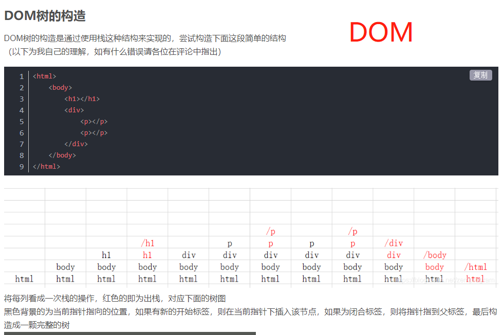
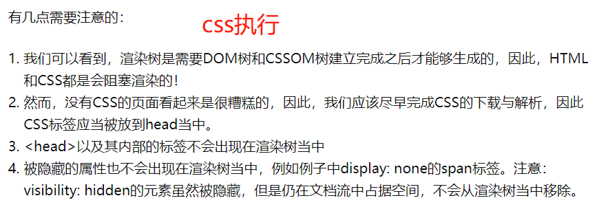
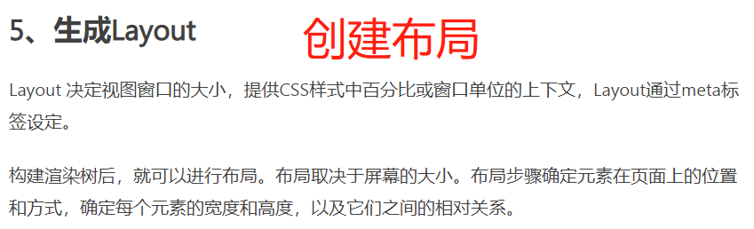

# 浏览器

## 1 DOM & CSSOM & JS





> 浏览器会把**html**解析成**DOM**, 把**CSS**解析成**CSSOM**, **DOM**和**CSSOM**合并就产生了**Render Tree(渲染树)**


+++

[^CSSOM]: **正如网页中HTML承担语义职能, CSS承担表现职能一样, 在计算机中DOM承担了语义职能, 而CSSOM承担了表现职能**

- CSSOM是CSS Object Model的缩写

- 大体上来说，CSSOM是一个建立在web页面上的 CSS 样式的映射

- 它和DOM类似，但是只针对CSS而不是HTML

- 浏览器将DOM和CSSOM结合来渲染web页面

- 所有的CSS都是阻塞渲染的（意味着在CSS没处理好之前所有东西都不会展示）

- ### CSSOM 在加载一个新页面时必须重新构建

- ### 页面中CSS的加载和页面中javascript的加载是有关系的

  - javascript的加载可能会阻塞CSSOM的构建

  - 简单来说，CSSOM是展示任何东西的必需品。在CSSOM构建之前，所有东西都不会展示，如果你阻塞了CSSOM的构建，CSSOM的构建就会消耗更长的时间，这就意味着页面的渲染也需要更长的时间。

    如果你的javascript阻塞了CSSOM的构建，你的用户就会面对更长时间的白屏

- **CSSOM对于页面渲染起着至关重要的作用。**

- **CSSOM是 [critical rendering path](https://www.jianshu.com/p/863fa5eacb17)(`关键渲染路径`) 的基本和核心，并且，它会有助于我们理解web性能优化中的原理。**


## 2 关键路径渲染 

> 
>
> 
>
> ***
>
> 
>
> 
>
> 
>
> 
>
> 
>
> 
>
> 
>
> 
>
> 
>
> 
>
> 
>
> ***
>
> 
>
> 
>
> 
>
> 

## 3 回流 & 重绘

> ***回流必将引起重绘, 重绘不一定会引起回流*** 
>
> ***回流比重绘的代价要更高。***
>
> 
>
> ***(1)当`Render Tree`中部分或全部元素的尺寸、结构、或某些属性发生改变时，浏览器重新渲染部分或全部文档的过程称为回流。***
>
> ***(2)当页面中元素样式的改变并不影响它在文档流中的位置时（例如：`color`、`background-color`、`visibility`等），浏览器会将新样式赋予给元素并重新绘制它，这个过程称为重绘。***


> 
>
> 
>
> ***
>
> 
>
> 


# css

## 1 深度选择器

> **[查看自带的样式代码](https://blog.csdn.net/YoungMan_09/article/details/124183560)**
>
> 
>
>  无论是直接使用 button 标签选择器还是其 类名 都无法选到来修改样式
>
> 这是因为在style中使用了 less(scss) 和 scoped
>
> 这个时候就需要用到 **深度选择器**了


# JS

## 1 宏任务 & 微任务

## 2 ajax, fetch, axios 区别

> + **Ajax隶属于原生js, 核心使用XMLHttpRequest对象, 多个请求之前有先后顺序的话, 就会出现回调地狱**
>   + 利用 XMLHttpRequest 模块实现 Ajax
> + **fetch不是ajax的进一步封装, 而是原生js, 没有使用XMLHttpRequest对象**
>   + fecth使用了 ES6 提出的 promise 对象。它是 XMLHttpRequest 的替代品。
>   + ***Fetch 是一个 API，它是真实存在的，它是基于 promise 的。***
>   + ***和 Ajax 又很大不同了，一个是思想，一个是真实存在的 API***
> + **

```js
// Ajax
<body>
    <script>
        function ajax(url) {
            const xhr = new XMLHttpRequest();
            xhr.open("get", url, false);
            xhr.onreadystatechange = function () {
                // 异步回调函数
                if (xhr.readyState === 4) {
                    if (xhr.status === 200) {
                        console.info("响应结果", xhr.response)
                    }
                }
            }
            xhr.send(null);
        }
        ajax('https://smallpig.site/api/category/getCategory')
    </script>
</body>

// fetch
// 使用 promise，不使用回调函数。
// 采用模块化设计，比如 rep、res 等对象分散开来，比较友好。
// 通过数据流对象处理数据，可以提高网站性能。
<body>
  <script>
    function ajaxFetch(url) {
      fetch(url).then(res => res.json()).then(data => {
        console.info(data)
      })
    }
    ajaxFetch('https://smallpig.site/api/category/getCategory')
  </script>
</body>
```


# NodeJS

## 1 状态码

## 2 post get请求区别


## 3 安装 ~ ^区别


## 4 dependencies & devpendencies

> **“ `devDependencies` 是开发环境下需要用到的依赖， `dependencies` 是生产环境下需要用到的依赖”**


# React

## 1 diff算法


## 2 受控组件 & 非受控组件

> **受控组件与非受控组件：是否受状态控制。**
>
> +  **改变state的唯一方式setState**
>
> + **受状态控制的组件，必须要有onChange方法，否则不能使用.**
> + **受控组件可以赋予默认值（官方推荐使用受控组件）**

> 两个输入框不受状态的控制。通过操作dom获取到value值，然后进行相加。**这就是非受控组件，他与受控组件的区别就是不可以给默认值。**

## 3 HashRouter & BrowserRouter

## 4 单页面应用

> **单页面应用: (SPA: Singer Page Application)**
>
>    指的是整个项目只有一个html文件, 但是页面里的内容依然可以切换

## 5 Component & Render区别

## 6 pureComponent & Component 区别

> + **使用component时, 父组件的state或props更新时, 无论子组件的state, props是否更新, 都会触发子组件的更新, 会形成很多没必要的render, 浪费性能**
> + **pureComponent的优点在于：pureComponent在shouldComponentUpdate只进行浅层的比较，只要外层对象没变化，就不会触发render,减少了不必要的render，当遇到复杂数据结构时，可以将一个组件拆分成多个pureComponent，以这种方式来实现复杂数据结构，以期达到节省不必要渲染的目的，如：表单、复杂列表、文本域等情况**

## 7 Effect闭包陷阱

## 8 react性能优化

> 1. **路由懒加载**
> 2. **避免使用内联函数**
>    + 每次render渲染时，都会创建一个新的函数实例，应该在组件内部创建一个函数，讲事件绑定到函数，这样每次调用render时，就不会创建单独的函数实例。
> 3. **使用react fragement 避免额外标记**
>    + 用户创建新组件时，每个组件应具有单个父标签，父级不能有两个标签。所以顶部要有一个公共标签，所以经常在组件顶部添加额外标签div，这个div标签充当父标签意外，没有其他作用，这个时候可以使用fragement，它不会向组件引入任何的额外标记，但是可以作为父级标签。
> 4. **事件绑定方式**
>    + 从性能考虑，在render方法中使用bind和箭头函数，都会生成新的方法实例，**在constructer中欧给使用bind和箭头函数，性能提高**
> 5. **使用immutable**
>    + 在react中使用immutablr能够带来性能优化，主要体现在减少渲染的次数，为了避免重复渲染，会在shouldComponentUpdate()中做对比，当返回true，执行[render](https://so.csdn.net/so/search?q=render&spm=1001.2101.3001.7020)方法。immutable通过is方法完成对比。
> 6. **服务端渲染**
>    + 可以使用户更快的看到显然成功的页面，服务端渲染可以起一个node服务，可以使用express。koa等，调用react的renderToString方法，将跟组件渲染成字符串，再输出到相应中
> 7. **组件拆分，合理使用hooks**

# vue

## 1. 计算属性和普通函数的区别

```
        计算属性是基于响应式依赖进行缓存的, 只有在相关依赖的数据发生了变化, 计算属性才会重新更新求值, 而函数是, 只要页面更新变化, 所有函数都会被触发,效率略低
```


